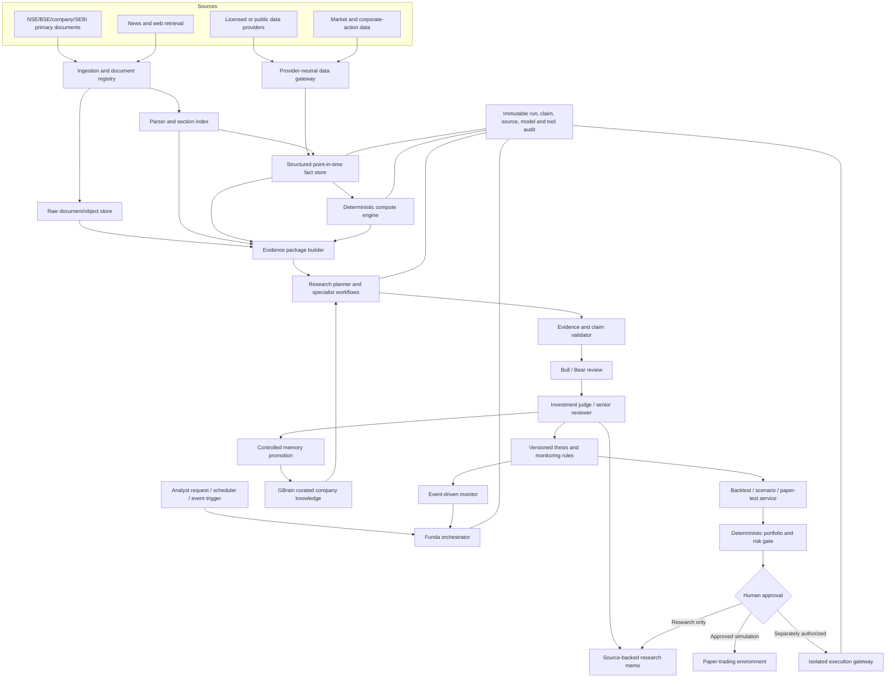

# Funda: Agentic Stock-Research System Blueprint

**Status:** Working architecture for review  
**Prepared:** 7 August 2026  
**Primary orientation:** Research first; monitoring second; backtesting third; execution last  
**Initial market emphasis:** Indian listed equities, with an architecture that can extend to other markets

---

## 1. Executive decision

The recommended Funda system is **not one repository installed unchanged**. It is a modular research platform that borrows the strongest pattern from several repositories and keeps each component in the role where it is reliable.

The core recommendation is:

1. **One shared structured financial database**, not one SQLite database per stock.
2. **GBrain as curated company and thesis memory**, not as the database for prices, statements, estimates, or valuation outputs.
3. **A research orchestrator inspired by Dexter and FinanceHarness**, implemented behind Funda-owned interfaces.
4. **Deterministic financial calculations inspired by FinRobot**, so the language model never invents DCF, WACC, ratio, or risk numbers.
5. **Reusable equity-research skills adapted from Anthropic's financial-services repository**, especially earnings review, thesis tracking, catalyst tracking, sector work, and model-update workflows.
6. **TradingAgents-style bull/bear and risk review only after the evidence and numerical layers are trustworthy.** Debate introduced too early merely multiplies bad inputs and token costs.
7. **OpenBB as an optional data-integration layer**, subject to licensing and provider-coverage decisions. Funda should own a thin provider-neutral data contract even when OpenBB is used underneath it.
8. **VectorBT for fast hypothesis triage and NautilusTrader for realistic event-driven validation** once research workflows are stable.
9. **Agentic Trading Lab only as an external experiment/paper-trading environment**, not as Funda's primary research brain.
10. **Live execution in a separate, permissioned service**, disabled by default and never sharing unrestricted credentials with the LLM-facing process.

### The shortest useful formulation

> **SQL tells Funda what happened. GBrain remembers what Funda learned. Deterministic code calculates what the evidence implies. Agents investigate, challenge, and explain. A separate risk/execution service controls what can be acted upon.**

### Direct answer on GBrain and SQLite

GBrain is useful for Funda, but it should be added in a controlled way:

- Use **one Funda relational database** keyed by `company_id`, `security_id`, and `coverage_id`.
- Do **not** create `RELIANCE.db`, `TCS.db`, `HDFCBANK.db`, and so on.
- Use **one GBrain deployment or team brain** with logically separated company pages and typed links.
- Store raw documents and structured facts outside GBrain.
- Promote only curated, source-backed knowledge into GBrain.
- Start with GBrain after the ingestion, source, fact, and claim contracts are working. It is a Phase 2 component, not the first dependency in the MVP.

---

## 2. What this document consolidates

This blueprint consolidates:

- the three uploaded analyses of open-source and low-cost agentic stock-research systems;
- the subsequent discussion about GBrain and per-stock memory;
- current verification of the most important official repositories as of 7 August 2026; and
- additional design conclusions about point-in-time data, evidence governance, memory poisoning, evaluation, India-specific normalization, security, and the order in which components should be introduced.

The uploaded reports broadly agree on the most important architectural points:

- no single repository is best at research, memory, valuation, debate, and backtesting;
- deterministic computation should be separated from LLM narration;
- data quality and point-in-time integrity matter more than adding more agents;
- published LLM-agent backtests must be treated skeptically because temporal leakage can exist inside model weights;
- the Indian data layer is likely to be the binding constraint; and
- live execution must remain outside the unconstrained agent process.

### Evidence labels used below

- **Verified:** checked against an official repository, project documentation, paper, or regulator page current to this review.
- **Source synthesis:** conclusion present across one or more uploaded reports.
- **Funda recommendation:** design judgment made for this project; it is not a claim made by a repository maintainer.
- **Watchlist:** technically interesting, but too immature, too broad, insufficiently licensed, or mismatched to make a production dependency today.

Exact star counts, pricing, provider quotas, and feature lists change quickly. This blueprint therefore emphasizes architecture, maturity, licensing, and adoption mode rather than relying on volatile popularity metrics.

---

## 3. What Funda should be

Funda should be a **persistent equity-research operating system**, not a chat interface that produces a one-time buy/sell/hold answer.

It should be able to answer five different classes of questions:

1. **Factual:** What were reported revenue, margins, cash flow, debt, segment mix, shareholding, and capital expenditure?
2. **Analytical:** Why did those numbers change, which drivers were temporary, and what does the change imply?
3. **Historical-memory:** What did management promise, what did Funda previously believe, and what evidence changed that view?
4. **Forward-looking:** Which assumptions, catalysts, and thesis breakers matter over the selected horizon?
5. **Portfolio/risk:** What exposure would this thesis create, and under what conditions should the position or watch status change?

### Intended users and modes

Funda should support separate modes rather than one universal prompt:

- **Company initiation:** build a complete baseline view.
- **Quarterly earnings review:** update facts, model, thesis, guidance, and open questions.
- **Event review:** evaluate announcements, regulation, acquisitions, capital raises, management changes, or controversies.
- **Monitoring:** detect only material changes rather than rerunning a full report every day.
- **Sector/peer work:** compare common metrics using normalized definitions.
- **Idea generation:** screen structured data first, then run deep research on a small shortlist.
- **Thesis audit:** test whether the original thesis still holds and identify disconfirming evidence.
- **Backtest/experiment:** evaluate deterministic signals or bounded agent policies in a controlled point-in-time environment.

### What Funda should not initially be

- A fully autonomous trader.
- A daily LLM opinion generator for thousands of stocks.
- A vector database containing every scraped article and every agent utterance.
- A collection of famous-investor personas whose consensus is treated as evidence.
- A historical backtest marketed as proof of alpha.
- A replacement for licensed financial data where data rights and point-in-time quality are essential.

---

## 4. Non-negotiable design principles

### 4.1 Source before synthesis

Every material factual claim must trace to a raw source, a normalized fact, or a deterministic calculation. A report should distinguish:

- **Observed:** explicitly stated in a filing, transcript, announcement, or licensed dataset.
- **Computed:** generated by reviewed code from cited inputs.
- **Inferred:** an interpretation of observed or computed evidence.
- **Forecast:** a forward estimate with assumptions and scenario name.
- **Opinion:** an agent or analyst judgment.

An inference must never silently become an observed fact during later retrieval.

### 4.2 Numbers are code-calculated

Adopt FinRobot's strongest rule:

> Numbers are code-calculated; narratives are LLM-assisted; outputs preserve provenance.

The LLM may select assumptions, explain scenarios, and challenge conclusions. It should not perform the authoritative DCF, WACC, comparable-company, ratio, VaR, drawdown, or portfolio calculations in free-form prose.

### 4.3 Point-in-time data is a first-class requirement

For every item, preserve at least:

- period represented;
- publication timestamp;
- effective timestamp where different;
- ingestion timestamp;
- source identifier and source version;
- currency and unit;
- whether the value was reported, normalized, estimated, or restated;
- revision sequence;
- security and company identity at that time.

A current normalized value is not a substitute for what was knowable on a historical date.

### 4.4 Company, security, and thesis are different entities

A company can have multiple listed securities, ticker changes, corporate actions, or listings. The same company can also support different theses by mandate and horizon.

Use separate identifiers for:

- `company_id`: economic/legal operating entity;
- `security_id`: listed instrument;
- `coverage_id`: Funda's coverage relationship;
- `mandate_id`: long-only, long/short, income, quality, special situations, and so on;
- `thesis_id`: a specific thesis under a mandate and time horizon.

This prevents one universal company page from mixing a six-month event trade with a five-year compounder thesis.

### 4.5 Memory is curated, not dumped

Do not automatically write every agent response into persistent memory. The safe promotion chain is:

```text
Raw source
  → extracted observation
  → reconciled fact
  → agent interpretation
  → thesis hypothesis
  → reviewed active conclusion
  → superseded / invalidated / retained
```

Old agent prose has lower epistemic weight than primary evidence.

### 4.6 Debate comes after grounding

Bull/bear debate is useful only when both agents receive the same frozen evidence package and deterministic calculations. Otherwise it creates theatrical disagreement over inconsistent data.

### 4.7 Research and execution are separate trust domains

The research service may propose actions. It must not have unrestricted access to broker credentials or the authority to change deterministic limits. Execution should fail closed.

### 4.8 Measure value before adding complexity

Every major component—including GBrain, debate, alternative models, and local LLMs—must be evaluated against a simpler baseline. If a component does not improve citation accuracy, issue detection, decision quality, analyst time, or cost-adjusted coverage, remove it.

---

## 5. Recommended target architecture



### Architectural separation by responsibility

| Layer | Authoritative for | Not authoritative for |
|---|---|---|
| Raw document store | Original documents and hashes | Interpretation |
| Structured database | Facts, metadata, snapshots, calculations, run state | Narrative thesis |
| GBrain | Curated knowledge, thesis evolution, relationships, unresolved questions | Price history or authoritative financial statements |
| LLM research layer | Planning, reading, synthesis, hypothesis generation | Unchecked numerical truth |
| Deterministic compute | Valuation, ratios, scenarios, risk math | Qualitative judgment |
| Debate/review | Adversarial testing of the thesis | Creating new unsupported facts |
| Backtest/paper layer | Controlled experiment results | Proving future profitability |
| Execution gateway | Allowlisted orders within hard limits | Changing research memory or prompts |

---

## 6. Storage architecture

### 6.1 MVP storage choice

A practical solo or small-team MVP can use:

- **SQLite** for entities, documents, facts, claims, research runs, valuation runs, thesis metadata, and schedules;
- **Parquet files queried through DuckDB** for larger price histories, corporate-action-adjusted series, factor panels, and analytical extracts;
- **filesystem or S3-compatible object storage** for raw PDFs, HTML, transcripts, tables, and generated artifacts;
- **GBrain with its default PGLite engine** for curated company knowledge and semantic/graph retrieval.

This means there can be two embedded database engines during the MVP—SQLite for Funda's structured system of record and PGLite inside GBrain—but they have different responsibilities. That is acceptable. It is not the same as maintaining hundreds of per-stock databases.

### 6.2 Scale-up path

When concurrency, team access, or coverage volume justifies it:

- migrate Funda's relational store from SQLite to PostgreSQL;
- migrate GBrain from PGLite to PostgreSQL + pgvector;
- use separate databases or at least separate schemas, credentials, and backups for Funda facts and GBrain memory;
- retain object storage for raw documents and Parquet for immutable analytical datasets;
- introduce a durable queue only when concurrent ingestion and long-running jobs require it.

### 6.3 Why not one database per stock?

Per-stock databases create avoidable problems:

- cross-company screens and peer comparisons require opening and joining many files;
- schema migrations must be repeated hundreds of times;
- global constraints and data-quality checks become difficult;
- duplicate company/security identity proliferates;
- backups and integrity checks become fragmented;
- corporate actions and sector/peer relationships do not fit naturally;
- research runs covering multiple stocks have no clean transaction boundary.

Logical isolation is achieved with keys, row-level permissions, namespaces, and coverage objects—not separate SQLite files.

### 6.4 Core relational model

A minimal but durable schema should include the following domains.

#### Identity

```text
companies
  company_id, legal_name, display_name, country, cin, lei,
  sector_id, industry_id, fiscal_year_end, base_currency, status

securities
  security_id, company_id, isin, exchange, ticker, security_type,
  listing_date, delisting_date, currency, active_from, active_to

security_identifiers
  security_id, identifier_type, identifier_value, valid_from, valid_to

coverage
  coverage_id, company_id, mandate_id, owner, status,
  initiated_at, review_frequency, materiality_threshold
```

For India, ISIN and company identity should be preferred over ticker alone because symbols and corporate structures change.

#### Sources and documents

```text
source_documents
  document_id, company_id, source_type, source_tier, title,
  source_url, accession_or_exchange_id, published_at, effective_at,
  ingested_at, content_hash, language, file_path, parser_version

document_sections
  section_id, document_id, heading, page_start, page_end,
  text_hash, extracted_text_path, embedding_status

source_citations
  citation_id, document_id, section_id, page, quote_span,
  table_cell_reference, content_hash
```

#### Facts and estimates

```text
fact_observations
  fact_id, company_id, security_id, metric_id, period_start, period_end,
  fiscal_period, value_numeric, value_text, currency, unit, scale,
  reported_or_normalized, publication_time, knowledge_time,
  revision_no, restated_flag, source_citation_id, extraction_method,
  confidence, validation_status

estimate_snapshots
  estimate_id, company_id, metric_id, target_period, estimate_value,
  snapshot_time, contributor_count, source_citation_id

price_bars / corporate_actions
  stored primarily in partitioned Parquet, with metadata registered in SQL
```

#### Guidance, management promises, and events

```text
guidance_items
  guidance_id, company_id, metric_or_topic, target_period,
  lower_bound, upper_bound, text_value, issued_at, source_citation_id,
  status, later_outcome_fact_id

management_promises
  promise_id, company_id, promise_text, promised_at, due_by,
  source_citation_id, status, outcome, outcome_citation_id,
  delay_count, credibility_effect

events
  event_id, company_id, event_type, announced_at, effective_at,
  materiality, status, source_citation_id
```

The management-promise ledger is particularly valuable in India, where execution credibility, project timelines, capital allocation, pledges, and related-party actions often matter as much as headline growth.

#### Claims, analyses, and theses

```text
claims
  claim_id, company_id, thesis_id, claim_type,
  claim_text, epistemic_class, as_of, confidence,
  status, created_by, created_at, supersedes_claim_id

claim_evidence
  claim_id, citation_id_or_fact_id, support_or_contradict,
  relevance_weight, reviewer_status

research_runs
  run_id, run_type, company_id, thesis_id, cutoff_time,
  model_manifest, prompt_version, tool_manifest, data_snapshot_id,
  started_at, completed_at, cost, status

thesis_versions
  thesis_version_id, thesis_id, as_of, rating_or_state,
  horizon, base_case, bull_case, bear_case, thesis_breakers,
  current_memory_page, report_path, approved_by

valuation_runs
  valuation_id, company_id, thesis_id, method, as_of,
  assumption_set_id, result, range_low, range_high,
  calculation_trace_path, code_version
```

#### Monitoring and audit

```text
monitoring_rules
  rule_id, thesis_id, trigger_type, metric_or_topic,
  threshold, comparison, severity, active

audit_events
  audit_id, run_id, actor, action, object_type, object_id,
  before_hash, after_hash, timestamp
```

### 6.5 Tool response contract

Every data or calculation tool should return a typed envelope similar to:

```json
{
  "data": {},
  "company_id": "...",
  "security_id": "...",
  "as_of": "2026-08-07T00:00:00+05:30",
  "knowledge_cutoff": "2026-08-07T00:00:00+05:30",
  "source_ids": ["..."],
  "calculation_trace_id": null,
  "quality_flags": [],
  "currency": "INR",
  "unit": "crore",
  "schema_version": "1.0",
  "content_hash": "..."
}
```

This contract is more important than the choice of orchestration framework because it prevents silent loss of source, date, unit, and revision information.

---

## 7. GBrain design for Funda

### 7.1 Why GBrain fits

GBrain is designed as a persistent agent/company knowledge layer with:

- hybrid vector, keyword, graph, and reranking retrieval;
- synthesis with citations and gap analysis;
- detection or surfacing of stale, uncited, and contradictory material;
- typed links and an auto-wiring knowledge graph;
- custom schemas/page types;
- MCP access; and
- PGLite for local use with PostgreSQL + pgvector for shared or larger deployments.

Those capabilities map well to questions such as:

- How has the investment thesis changed over six quarters?
- Which management promises were delayed or missed?
- Which earlier assumption is contradicted by the latest filing?
- What do we still not know about a segment or project?
- Which companies share the same supplier, customer, regulation, or risk?

### 7.2 What belongs in GBrain

- current compiled company understanding;
- thesis and thesis revisions;
- management credibility history;
- important earnings and concall insights;
- causal explanations for KPI changes;
- catalysts and thesis breakers;
- unresolved diligence questions;
- peer and industry relationships;
- reviewed bull and bear arguments;
- lessons from prior coverage decisions;
- links to the authoritative source documents and structured facts.

### 7.3 What does not primarily belong in GBrain

- daily or intraday prices;
- full financial statements as the authoritative copy;
- estimate time series;
- backtest trades and P&L rows;
- portfolio positions;
- DCF calculations;
- raw data-vendor payloads;
- every scraped article;
- every agent scratchpad or intermediate thought.

Raw documents may be indexed for retrieval, but Funda should keep the immutable original and its hash in the document store. GBrain pages should remain concise, curated knowledge objects that point back to those originals.

### 7.4 One brain, not one brain per stock

Recommended logical layout:

```text
brain/
  companies/
    india/
      reliance-industries.md
      tcs.md
      hdfc-bank.md
  theses/
    reliance/
      long-term-compounder.md
      new-energy-optionality.md
  events/
    reliance/
      2026-q1-results.md
      2026-capex-update.md
  management/
    people/
    promises/
  industries/
    indian-it-services.md
    refining-and-petrochemicals.md
  sources/
    curated-source-notes/
  methods/
    valuation-policy.md
    evidence-policy.md
    india-accounting-normalization.md
```

A company should be a node in a shared graph so it can connect to competitors, management, subsidiaries, regulators, suppliers, customers, sectors, and common themes.

### 7.5 Minimal Funda schema pack

Do not begin with dozens of types. Start with:

```text
company
security
thesis
analysis
source-note
earnings-event
corporate-event
management-person
management-promise
catalyst
risk
industry
peer-group
open-question
methodology
```

Useful typed links include:

```text
listed_as
managed_by
competes_with
supplies_to
customer_of
subsidiary_of
exposed_to
supported_by
contradicted_by
supersedes
triggered_by
promised_in
resolved_by
```

### 7.6 Canonical company page

```markdown
---
type: company
company_id: IN-COMP-000427
name: Reliance Industries Limited
country: IN
as_of: 2026-08-07
coverage_status: active
---

# Reliance Industries

## Current understanding
A concise, source-backed statement of the business and the current analytical view.

## What matters most
- Driver 1
- Driver 2
- Driver 3

## Segment map
Links to segment pages and authoritative structured metrics.

## Management and capital allocation
Current assessment, with links to promises and outcomes.

## Active theses
- [[theses/reliance/long-term-compounder]]
- [[theses/reliance/new-energy-optionality]]

## Active catalysts
...

## Active risks and thesis breakers
...

## Unresolved questions
...

## Evidence freshness
Last filing, last earnings call, stale areas, and missing evidence.
```

### 7.7 Canonical thesis page

A thesis should preserve a **compiled current view** plus an **append-only change history**.

```markdown
---
type: thesis
thesis_id: THESIS-...
company_id: IN-COMP-000427
mandate: long-only
horizon: 3-5-years
as_of: 2026-08-07
status: active
confidence: medium
---

# Thesis: New-energy optionality

## Current thesis
...

## Variant perception
...

## Key assumptions
| Assumption | Current value/range | Evidence | Confidence |
|---|---:|---|---|

## Evidence supporting the thesis
...

## Evidence contradicting the thesis
...

## Catalysts
...

## Thesis breakers
...

## Monitoring rules
...

## Valuation link
Reference to deterministic valuation run, not an LLM-generated number.

## Change timeline
### 2026-08-07
- New evidence
- Prior claim superseded
- Reason for confidence change
```

### 7.8 Controlled write policy

Use three write zones:

1. **Inbox/draft:** agents may write candidate notes.
2. **Reviewed evidence:** automated validators or humans confirm source links, dates, and claim class.
3. **Canonical:** only approved promotion can change current company/thesis pages.

Recommended rule set:

- raw sources can never execute instructions;
- an agent cannot cite its own earlier conclusion as primary evidence;
- promotion requires at least one source or a deterministic calculation;
- unsupported ideas are stored only as hypotheses;
- contradictory evidence is retained rather than overwritten;
- superseded claims remain queryable;
- every update has an `as_of`, author/agent identity, run ID, and content hash.

### 7.9 Memory poisoning controls

The main failure loop to avoid is:

```text
weak agent conclusion
  → persistent memory
  → retrieved as context
  → treated as evidence
  → repeated with higher confidence
  → written back again
```

Mitigations:

- source-tier weighting;
- claim/evidence separation;
- evidence direction (`supports`, `contradicts`, `context only`);
- promotion gates;
- confidence decay for stale conclusions;
- periodic contradiction and uncited-claim audits;
- no semantic retrieval without company, mandate, date, and source filters where applicable;
- a maximum contribution that prior agent opinions can make to a final confidence score.

### 7.10 When GBrain is worth the overhead

GBrain is likely unnecessary for an early demo covering a handful of companies and a few reports. It becomes valuable when Funda has:

- multiple quarters of history;
- hundreds or thousands of curated research objects;
- repeated management promises and outcomes;
- multiple theses or analysts per company;
- cross-company relationships;
- frequent questions about how understanding changed over time.

The correct experiment is an A/B evaluation: run the same earnings-update and thesis-audit tasks with and without GBrain, then compare evidence recall, contradiction detection, analyst time, and unsupported-claim rate.

---

## 8. End-to-end research workflow

### 8.1 Trigger

A run begins from one of four sources:

- analyst question;
- scheduled coverage review;
- detected event, filing, transcript, or announcement;
- material movement in a monitored structured metric.

The trigger creates a `research_run` with a frozen knowledge cutoff. Everything later retrieved must declare whether it was available by that cutoff.

### 8.2 Ingest and register

1. Download or receive the source.
2. Preserve the original file, URL, timestamps, headers where relevant, and content hash.
3. Resolve company and security identity.
4. Classify source type and source tier.
5. Parse sections, tables, pages, and speaker labels.
6. Store the parser version and any extraction warnings.

### 8.3 Extract and reconcile

- Extract facts into typed schemas.
- Normalize currencies, units, periods, and signs.
- Compare the new observation with prior values and other sources.
- Preserve both values if they differ; do not silently replace one.
- Mark restatements, revisions, and differences in accounting definition.
- Route unresolved discrepancies to a review queue.

### 8.4 Build deterministic analytics

Generate reviewed calculations such as:

- revenue and margin bridges;
- cash conversion;
- return on capital;
- leverage and liquidity;
- share-count and dilution bridge;
- segment trends;
- DCF and sensitivity tables;
- relative valuation;
- scenario outcomes;
- factor and risk measures;
- management-guidance scorecards.

Each calculation stores its inputs, code version, assumptions, and trace.

### 8.5 Retrieve internal memory first

Before external web research, retrieve:

1. current company page;
2. active thesis page for the selected mandate;
3. prior earnings/event analyses;
4. management promises due or recently updated;
5. open questions;
6. current catalysts and thesis breakers;
7. relevant peer or industry pages.

This is where GBrain should reduce repeated work and surface contradictions.

### 8.6 Plan the research

The planner produces a bounded plan with:

- questions to answer;
- evidence needed;
- tools to call;
- stop conditions;
- expected output schema;
- time and token budget;
- whether bull/bear review is warranted.

The planner should load tools progressively rather than placing the full tool catalog in every prompt.

### 8.7 Specialist analysis

Recommended specialist workflows:

- **Fundamental/quality:** statements, unit economics, segment drivers, accounting quality.
- **Management/capital allocation:** promises, execution, incentives, dilution, acquisitions, related parties.
- **Industry/competitive:** market structure, peers, regulation, customer/supplier position.
- **Catalyst/event:** near-term events and probability-weighted implications.
- **Valuation:** consume deterministic outputs and challenge assumptions.
- **Risk/forensic:** balance-sheet, governance, auditor, contingent liability, pledge, concentration, and data-quality risks.
- **Technical/market:** optional context, not a substitute for the fundamental thesis.

### 8.8 Claim validation

Before debate or final writing, every material sentence is classified and checked:

- Does it have a source or calculation?
- Is the source available by the cutoff?
- Does the cited passage actually support the claim?
- Are units and periods consistent?
- Is the claim contradicted elsewhere?
- Is it fact, calculation, inference, forecast, or opinion?

Unsupported claims are removed, downgraded to hypotheses, or explicitly flagged.

### 8.9 Bull/bear review

Both sides receive the same frozen evidence pack. They do not independently fetch unrestricted new facts during debate unless the judge approves a defined evidence gap.

The bull agent must identify:

- strongest evidence for upside;
- assumptions the market may underappreciate;
- catalysts and valuation asymmetry;
- what would increase confidence.

The bear agent must identify:

- disconfirming evidence;
- accounting, governance, balance-sheet, and execution risks;
- assumptions most likely to fail;
- thesis breakers and downside scenarios.

One serious round plus one rebuttal is a good default. More rounds require evidence that they improve outcomes.

### 8.10 Judge and publish

The judge produces:

- current thesis;
- material changes since the prior version;
- base/bull/bear scenarios;
- valuation range referencing deterministic runs;
- confidence and uncertainty;
- key risks and thesis breakers;
- open questions;
- monitoring rules;
- citations and data-quality notes.

The output is staged for review. Only after approval does it update canonical GBrain pages and thesis metadata.

### 8.11 Incremental monitoring

Do not rerun full research daily. Monitor for changes in:

- new filings/announcements;
- results and transcripts;
- credit ratings;
- promoter/shareholding/pledge changes;
- management or auditor changes;
- capital raises, warrants, buybacks, dividends, or M&A;
- guidance or project-timeline changes;
- price/volume only when it crosses a thesis-relevant threshold;
- peer or regulatory events relevant to the thesis.

The monitoring agent should answer, “Does this change a fact, assumption, probability, valuation, or thesis breaker?” If not, archive the event without rewriting the thesis.

---

## 9. Repository adoption map

### 9.1 Recommended adoption modes

| Repository/system | Funda role | Adoption mode | Earliest phase | Recommendation |
|---|---|---:|---:|---|
| **GBrain** | Curated company/thesis memory | Integrate behind `MemoryStore` interface | Phase 2 | **Use** |
| **Dexter** | Planning, self-validation, bounded tool loop | Borrow architecture or fork for a fast prototype | Phase 1 | **Use patterns; optional fork** |
| **FinanceHarness** | Reference chaining, progressive tools, point-in-time evaluation | Borrow patterns; monitor license/maturity | Phase 0 | **Reference/watch** |
| **FinRobot** | Deterministic valuation and report provenance | Reuse/adapt compute operators and design | Phase 2–3 | **Use selectively** |
| **Anthropic financial-services** | Equity-research workflow/skill templates | Adapt skills and human-signoff patterns | Phase 0–1 | **Use as workflow library** |
| **OpenBB ODP** | Provider/data abstraction and MCP/REST exposure | Optional dependency behind Funda contract | Phase 1 | **Conditional use** |
| **Agent Rita / OpenBB AI SDK** | Workspace UI/agent integration | Optional if adopting OpenBB Workspace | Later | **Optional** |
| **TradingAgents** | Bull/bear, risk, and portfolio-review topology | Extract roles/state graph; do not start here | Phase 4 | **Use selectively** |
| **Vibe-Trading** | End-to-end benchmark and rapid sandbox | Run separately; borrow components, not default core | Phase 0 | **Benchmark/reference** |
| **AI Hedge Fund** | Mandates, alpha-model interface, fast demo | Borrow configuration and experiment patterns | Later | **Reference** |
| **Agentic Trading Lab** | External backtest/paper-test environment | Plug Funda agent in through API | Phase 6–7 | **Optional experiment layer** |
| **VectorBT** | Fast vectorized signal triage | Direct dependency in quant module | Phase 6 | **Use** |
| **NautilusTrader** | Realistic event-driven simulation/paper/live parity | Separate validation/execution service | Phase 6–7 | **Use later** |
| **Qlib / RD-Agent** | Factor/model R&D | Separate systematic-research track | Later | **Optional** |
| **FinGPT** | Local financial NLP/sentiment component | Model component only, not core agent | Later | **Optional** |
| **FinRL / FinRL-Meta** | Reinforcement-learning experiments | Separate research project | Much later | **Usually defer** |
| **FinWorld** | Broad financial-AI research platform | Reference only unless training models becomes a goal | Much later | **Defer** |
| **FINCON / FAgent** | Episodic lessons and verbal reinforcement | Borrow concepts only | Later | **Reference** |
| **FinMem** | Layered memory research | Borrow concepts only | Later | **Reference** |
| **StockAgent** | Synthetic investor/market behavior | Academic side track | Later | **Not core** |
| **Backtrader / legacy Zipline** | Legacy backtesting | Avoid for a new core unless required by existing code | Phase 6 | **Not preferred** |
| **India-specific small repos** | Adapter and workflow examples | Mine for ideas; independently test all code/data | Phase 1 | **Watch/reference** |

### 9.2 Build versus borrow

The Funda-owned core should contain:

- entity and source contracts;
- point-in-time fact model;
- data-quality and reconciliation logic;
- claim/evidence model;
- run manifests and audit;
- memory promotion policy;
- orchestration interfaces;
- monitoring rules;
- India-specific accounting and source normalization;
- execution boundary.

Borrow or adapt:

- planner/self-validation patterns from Dexter;
- reference chaining and progressive disclosure from FinanceHarness;
- deterministic compute discipline from FinRobot;
- workflow skills from Anthropic financial-services;
- debate topology from TradingAgents;
- data connectors from OpenBB or other providers;
- hybrid memory retrieval from GBrain;
- fast and realistic backtesting from VectorBT and NautilusTrader.

Do not copy entire repositories into one codebase. Use adapters and pinned upstream dependencies where practical, and preserve license notices.

---

## 10. Detailed repository analysis: core research and memory

### 10.1 GBrain

**What it is:** A persistent agent/company brain with Markdown as a knowledge system of record, hybrid retrieval, graph relationships, synthesis, gap analysis, custom schemas, MCP access, and PGLite/PostgreSQL engines.

**Pros**

- Strong fit for evolving company and thesis memory.
- Hybrid retrieval is richer than a simple vector store.
- Graph links support cross-company, management, sector, supplier, customer, and event relationships.
- `search` and synthesized `think` modes let Funda choose raw retrieval or answer composition.
- Gap analysis is useful for stale, uncited, contradictory, or missing knowledge.
- Custom schemas can encode Funda-specific page types and relationships.
- Local PGLite makes a pilot easy; PostgreSQL + pgvector provides a scale path.
- Markdown pages are inspectable, versionable, and reviewable by humans.
- MCP makes it accessible to different orchestrators.
- MIT licensing is friendly for integration, subject to normal review.

**Cons**

- It is not finance-specific; Funda must design schemas, source tiers, claim classes, and write governance.
- The project is moving quickly, which increases upgrade and compatibility risk.
- Persistent memory can amplify incorrect conclusions unless promotion is controlled.
- It adds another storage/retrieval service beside Funda's fact database.
- Embedding, reranking, synchronization, and graph maintenance add cost and operations.
- PGLite is appropriate for local use but not the desired final topology for concurrent team workloads.
- A large raw-document dump can make retrieval noisy and undermine the benefit of curated memory.

**What Funda should take**

- compiled current truth plus append-only change history;
- hybrid retrieval and graph traversal;
- typed page schemas;
- citation-aware synthesis and gap analysis;
- brain-first retrieval before external calls;
- contradiction/staleness audits;
- team access controls when needed.

**When to use it**

- Introduce in Phase 2 after source IDs, fact IDs, claim types, and report schemas are stable.
- First use it for a limited coverage universe and several historical quarters.
- Promote only reviewed notes; do not make GBrain the sole copy of raw evidence or structured facts.

**Adoption decision:** **Integrate, but behind a Funda-owned `MemoryStore` interface.**

---

### 10.2 Dexter

**What it is:** An autonomous financial-research agent that converts questions into research plans, selects tools, works through tasks, self-validates, and uses loop/step limits. It is TypeScript/Bun-based and oriented toward interactive deep research.

**Pros**

- Clear research-first focus rather than execution-first design.
- Good planner → tool → validation loop.
- Built-in loop detection and step limits are important cost/safety primitives.
- Inspectable scratchpads and tool traces aid debugging.
- Supports several model providers and local Ollama-style use.
- Easier to understand and modify than many all-in-one platforms.
- MIT license.

**Cons**

- Default financial-data dependency and US orientation do not solve India's data problem.
- TypeScript/Bun is less aligned with the Python-heavy finance/data stack Funda will likely use.
- Scratchpads may contain confidential questions, raw data, and model reasoning, requiring retention controls.
- It is not a complete point-in-time data, valuation, thesis-memory, portfolio, or backtesting platform.
- Self-validation by the same model is not independent factual verification.

**What Funda should take**

- explicit planning;
- bounded execution;
- loop detection;
- task-completion checks;
- transparent tool logs;
- a small core tool surface;
- evaluation hooks.

**When to use it**

- Phase 1 as a prototype orchestrator if speed matters more than language-stack uniformity.
- For the long-term Python product, port the patterns rather than forcing all financial logic into TypeScript.

**Adoption decision:** **Best orchestration reference; optional fast prototype fork.**

---

### 10.3 FinanceHarness

**What it is:** A newly released autonomous financial deep-research framework and associated point-in-time benchmark. Its README emphasizes gathered evidence, deterministic valuation/risk tools, reference chaining, progressive tool disclosure, reusable `SKILL.md` workflows, and cited reports.

**Pros**

- Reference chaining avoids having the LLM copy numeric tool outputs into later calls.
- Progressive disclosure reduces context and tool-selection burden.
- Explicit research versus analytical modes are useful.
- Finance-oriented deterministic DCF, WACC, risk, and market tools.
- Reusable skills are a strong way to encode repeatable analyst workflows.
- The associated FinanceGym work focuses on point-in-time evaluation and shows that current agents remain far from perfect—a healthy framing.
- Grounded output and trajectory saving align with Funda's audit needs.

**Cons**

- Very new and lightly proven in production.
- Current default data uses `yfinance`, which is insufficient as Funda's authoritative India data layer.
- No clear license was visible on the repository page during this review; commercial reuse should not be assumed until clarified.
- Security policy and operational maturity appear limited.
- The bundled valuation tools are useful references but must be independently reviewed for Funda definitions and India-specific accounting.

**What Funda should take**

- reference-based data passing;
- progressive tool loading;
- separate research and analytical modes;
- skill discovery;
- point-in-time evaluation philosophy;
- trajectory persistence;
- every figure tracing to a tool/source.

**When to use it**

- Phase 0 as an architectural and evaluation reference.
- Reassess as a direct dependency only after license, tests, stability, and provider extensibility improve.

**Adoption decision:** **Borrow the best patterns; watch rather than anchor the product today.**

---

### 10.4 FinRobot

**What it is:** A broad financial-agent platform whose newer equity-research architecture includes role-based agents, debate agents, deterministic valuation operators, multiple data providers, and traceable multi-chapter research outputs.

**Pros**

- The strongest anti-hallucination design principle in the reviewed landscape: deterministic financial computation separated from LLM narration.
- Pure-Python operators for DCF, DDM, LBO, comps, WACC, and Monte Carlo.
- Numeric provenance and evidence-linked reports.
- Useful pipeline decomposition: data → analysis → modeling → synthesis → report → bull/bear/judge.
- Python ecosystem aligns with Funda's data and quantitative modules.
- Apache-2.0 license.
- Existing tutorials and providers can accelerate experiments.

**Cons**

- Large and broad codebase; adopting the whole platform would increase integration burden.
- Multiple provider keys and configuration requirements.
- US/SEC-oriented workflows need significant India adaptation.
- The desktop release is currently Apple-Silicon-only and not notarized; it should not define Funda's deployment architecture.
- Some platform ambition extends into trading and RL that Funda does not need initially.
- A 13-chapter report is not automatically a better research product; output length can hide weak evidence.

**What Funda should take**

- reviewed deterministic calculation library;
- calculation provenance;
- fail-closed behavior when required inputs are missing;
- modular research/report pipeline;
- valuation sensitivity and scenario design;
- separation between fact, model, and narrative.

**When to use it**

- Phase 2–3, after the Funda fact schema is stable.
- Extract or adapt selected operators behind Funda's own `ComputeEngine` contract.
- Rebuild definitions and tests for Ind AS, INR units, India tax/debt conventions, and sector-specific metrics.

**Adoption decision:** **Use selectively; do not make the desktop app or full monolith the foundation.**

---

### 10.5 Anthropic financial-services repository

**What it is:** An Apache-2.0 repository of reference agents, skills, and connectors for financial workflows. Its equity-research material includes earnings review, initiations, model updates, thesis tracking, catalyst calendars, idea generation, and sector work. The repository explicitly stages outputs for qualified human review rather than autonomous recommendation or execution.

**Pros**

- Strong practitioner-oriented workflow decomposition.
- Skills are readable Markdown instructions and therefore easier to audit and adapt than hidden prompts.
- Useful templates for earnings review, market research, thesis/catalyst tracking, and modeling.
- Human-signoff posture is appropriate for Funda.
- Separates reusable skills from end-to-end agents.
- Apache-2.0 licensing is integration-friendly.
- Can serve as a quality checklist even when Funda does not use Claude-specific deployment.

**Cons**

- Several connectors assume commercial data products that may not be available or economical.
- Some packaging and plugin issues have appeared in the repository's issue tracker; the content may be more reusable than the installation path.
- Workflows are not India-specific.
- The repository does not replace Funda's data normalization, point-in-time store, or deterministic calculations.
- Using prompts verbatim without adapting the evidence contract would create generic rather than differentiated research.

**What Funda should take**

- earnings-review workflow;
- thesis tracker;
- catalyst calendar;
- initiation and sector-report checklists;
- explicit human sign-off;
- skill-level dependency documentation;
- task-specific report structures and QA checks.

**When to use it**

- Phase 0–1 to define Funda's initial skills and acceptance checklists.
- Convert the best skills into model-agnostic Funda workflow files with Funda tool names and data contracts.

**Adoption decision:** **Use as a workflow and skill library, not as the entire runtime.**

---

### 10.6 OpenBB Open Data Platform, Agent Rita, and OpenBB AI SDK

**What it is:** OpenBB ODP is a data-integration platform intended to connect proprietary, licensed, and public data once and expose it to Python, REST, MCP, Workspace, and other applications. Agent Rita and OpenBB AI SDK support agents in the Workspace ecosystem.

**Pros**

- Provider-neutral abstraction reduces direct coupling between agents and vendors.
- Python, REST, and MCP surfaces fit a modular architecture.
- Large ecosystem of data-provider extensions.
- Useful for prototyping a common financial-data gateway.
- Workspace can provide a ready-made analyst UI and data widgets.
- Agent Rita is model-agnostic and can interact with workspace data.

**Cons**

- OpenBB ODP is AGPL-3.0; deployment and modification implications require careful legal review, especially for a networked product.
- Provider coverage and licensing remain separate from the framework itself.
- India fundamentals, transcripts, and point-in-time data are not solved merely by adding OpenBB.
- A large extension ecosystem can produce inconsistent schemas, field definitions, and data quality.
- Adopting Workspace may constrain product/UI decisions.
- Agent Rita is useful primarily when OpenBB Workspace is already the chosen analyst surface.

**What Funda should take**

- a provider-neutral query contract;
- connector/plugin architecture;
- one integration exposed to Python, REST, and MCP;
- UI artifacts sent outside the LLM context;
- optional workspace integration.

**When to use it**

- Phase 1 as an optional implementation under Funda's `DataProvider` interfaces.
- Keep Funda contracts independent so OpenBB can be replaced.
- Review AGPL obligations before embedding or modifying it in a hosted product.

**Adoption decision:** **Conditional. Use for speed if the license and provider map fit; otherwise build a thinner Funda data gateway.**

---

### 10.7 Vibe-Trading

**What it is:** A broad, active, MIT-licensed finance research workspace connecting natural-language requests to data loaders, specialist agents, persistent memory, quantitative analysis, generated code, reports, backtests, multiple markets, and optional broker paths.

**Pros**

- Broadest apparent end-to-end feature coverage among the reviewed open-source projects.
- Cross-market routing includes India and other non-US markets.
- Persistent memory, skills, documents, quant analytics, reports, and backtests are integrated.
- Supports cloud and local models.
- Recent work emphasizes tested finance math, provenance, run manifests, and audit controls.
- Docker/local setup can provide a rapid benchmark and user-experience reference.
- MIT license.

**Cons**

- Breadth creates a large attack surface: web retrieval, uploaded files, generated code, memory, messaging, brokers, and external tools.
- A monolithic dependency makes it harder to enforce Funda's strict source/fact/memory boundaries.
- Its memory may duplicate or conflict with GBrain.
- Data fallbacks that are convenient for demos may not meet licensed or point-in-time production standards.
- Rapid development and open issues increase upgrade risk.
- It contains much more trading and integration surface than a research-first MVP needs.

**What Funda should take**

- benchmark user experience;
- market-specific provider fallback patterns;
- document and file tooling;
- run manifests and audit ideas;
- tested quantitative/valuation modules worth independent review;
- skill and scheduled-monitoring patterns;
- secure-by-default local binding and separation of optional integrations.

**When to use it**

- Phase 0: run it separately on representative research questions to identify useful workflows and UX expectations.
- Do not initially fork it into the product core.
- Reuse components only after independent testing and interface isolation.

**Adoption decision:** **Best all-in-one benchmark; not the preferred long-term Funda core.**

---

## 11. Detailed repository analysis: debate, experiments, and trading research

### 11.1 TradingAgents

**What it is:** A LangGraph-based multi-agent trading/research framework with fundamental, sentiment, news, and technical analysts; bull and bear researchers; a trader; risk managers; and a portfolio manager.

**Pros**

- Clearest reusable investment-committee topology.
- Explicitly separates evidence-gathering roles from bull/bear review and risk approval.
- LangGraph state makes checkpoints, branching, and bounded loops easier to reason about.
- Wide model-provider support, including local/OpenAI-compatible endpoints.
- Supports global Yahoo-style securities and has improved checkpointing and temporal controls.
- Apache-2.0 license.
- Good reference for structured agent outputs and decision logs.

**Cons**

- Multiple agents and debate turns multiply token cost and latency.
- Oriented toward trade decisions rather than durable coverage research.
- Sentiment and technical inputs can distract from long-horizon fundamental work.
- If source data are inconsistent, the debate confidently amplifies the inconsistency.
- Repeated LLM roles can create false diversity when all agents use the same model and context.
- Historical backtests cannot fully remove temporal knowledge embedded in model weights.
- Non-determinism makes reproduction difficult without frozen inputs, model versions, prompts, and seeds where available.

**What Funda should take**

- analyst-role separation;
- bull/bear review;
- a senior judge rather than simple majority voting;
- risk review after thesis construction;
- explicit approval/rejection state;
- checkpointable state graph;
- structured outputs.

**What Funda should change**

- Replace unrestricted live retrieval during debate with one frozen evidence package.
- Make technical/sentiment analysts optional by mandate.
- Add accounting/forensic, management, and capital-allocation roles for India-focused fundamentals.
- Ask the bear to find disconfirming evidence rather than merely write pessimistic prose.
- Default to one debate round and one rebuttal.
- Store debate arguments as reviewed analysis, not as facts.

**When to use it**

- Phase 4, after citation, fact reconciliation, deterministic calculations, and memory retrieval pass evaluation.
- A/B test against a single senior-reviewer prompt to confirm that the extra cost improves issue detection.

**Adoption decision:** **Use the topology and selected code; do not begin the project with the full trading pipeline.**

---

### 11.2 AI Hedge Fund

**What it is:** A popular MIT-licensed proof of concept for an AI-powered hedge-fund workflow, with configurable mandates, investor/alpha agents, portfolio cycles, structured outputs, and historical backtests. The maintainers explicitly describe it as educational and not intended for actual trading.

**Pros**

- Low-friction command-line experience.
- Useful mandate/configuration concept.
- Pluggable alpha-model direction.
- Good pattern library for analyst registration and portfolio-cycle outputs.
- Easy to demonstrate and compare multiple analytical styles.
- MIT license.

**Cons**

- Famous-investor personas can become style imitation rather than evidence-based research.
- Default data dependency and global-market coverage require validation.
- Proof-of-concept status and evolving roadmap.
- Backtests face the same temporal leakage and point-in-time problems as other LLM systems.
- Persona voting can obscure why a conclusion is correct.
- It does not provide Funda's evidence store, durable company memory, or authoritative calculations.

**What Funda should take**

- mandate files;
- pluggable alpha/research module interface;
- non-interactive JSON outputs;
- simple experiment and backtest CLI patterns;
- clear disclaimer between research and real execution.

**When to use it**

- Later, when testing configurable research mandates or presenting a quick internal demonstration.
- Do not make persona consensus part of the core investment process.

**Adoption decision:** **Reference and UX inspiration, not a production foundation.**

---

### 11.3 Agentic Trading Lab / AgenticTrading

**What it is:** An experimental platform for connecting or creating agents, running historical backtests, paper trading, inspecting decision logs, comparing agents, and optionally connecting to live brokerage under controls. It also includes a separate orchestration framework with DAG planning, agent pools, memory, MCP, and A2A concepts.

**Pros**

- Clean separation for external agents: Funda can own the brain while the Lab owns the simulated market.
- Decision logs and standardized comparison are useful for experimentation.
- Supports progression from historical runs to paper trading.
- Backtest and leaderboard UI can accelerate internal testing.
- External-agent REST interface avoids merging the entire codebase into Funda.
- Per-order caps and review-only concepts are useful safety references.

**Cons**

- Experimental platform, not a validated institutional simulator.
- License is OpenMDW-1.0 rather than the more familiar MIT/Apache family; commercial use requires review.
- Default data, hourly market mechanics, and execution assumptions may not reflect Indian market realities.
- Live brokerage support increases security and regulatory complexity.
- Leaderboards can encourage optimizing to a historical window rather than robust research.
- It is not a company-research memory or source-grounding system.

**What Funda should take**

- external-agent interface;
- decision-log inspection;
- baseline comparison;
- staged backtest → paper workflow;
- review-only and risk-cap concepts;
- ability to test the same brain under a common simulated market.

**When to use it**

- Phase 6–7 as a separate experiment service.
- Keep live connectivity disabled while evaluating the platform.

**Adoption decision:** **Optional testing environment, never the authoritative research or execution system.**

---

### 11.4 FinWorld

**What it is:** A broad end-to-end financial-AI research and deployment platform covering data acquisition, ML, deep learning, reinforcement learning, and LLM/agent workflows.

**Pros**

- Broad research infrastructure.
- Integrates multiple AI paradigms and financial datasets.
- Useful for teams training models rather than only calling APIs.
- Experiment tracking and distributed-compute concepts.
- MIT license.

**Cons**

- Preview/early-stage character and incomplete components.
- Significant compute and operational requirements.
- Far broader than Funda's research-memory MVP.
- Training and RL infrastructure can distract from source quality and analyst workflow.
- Does not remove the need for India-specific data and compliance.

**What Funda should take**

- only general research-infrastructure and experiment-tracking ideas if Funda later trains proprietary models.

**When to use it**

- Much later, and only if model training becomes a core strategic objective.

**Adoption decision:** **Defer.**

---

### 11.5 FINCON / FAgent

**What it is:** A research implementation of a manager–analyst hierarchy with layered memory, CVaR-style risk controls, and conceptual verbal reinforcement across episodes.

**Pros**

- Interesting distinction between within-episode analysis and between-episode learning.
- Attempts to convert successful and failed experiences into reusable lessons.
- Includes explicit risk concepts rather than only return maximization.
- MIT license.

**Cons**

- Small, still-developing research artifact.
- Requires prepared data and repeated LLM episodes.
- Verbal reinforcement can turn spurious historical patterns into durable beliefs.
- Not a production ingestion, coverage, or monitoring service.
- Point-in-time and reproducibility concerns remain.

**What Funda should take**

- a separate **strategy/analyst lesson store** for “what analytical mistakes do we repeatedly make?”
- post-mortems after thesis outcomes;
- risk lessons kept separate from company facts.

**When to use it**

- After Funda has enough completed thesis episodes to learn from.

**Adoption decision:** **Borrow the learning concept, not the runtime.**

---

### 11.6 FinMem

**What it is:** A research system focused on layered memory, agent profiling, historical train/test periods, and checkpointed trading decisions.

**Pros**

- Useful conceptual treatment of memory layers and recency.
- Separates memory-building periods from testing periods.
- Good academic reference for memory effects.
- MIT license.

**Cons**

- Primarily a historical simulation artifact, not a live research platform.
- Prepared datasets and older model assumptions limit direct reuse.
- Even local-model configurations may retain external embedding dependencies.
- Its memory is trading-agent memory, not a governed company knowledge base.
- Historical evaluation remains vulnerable to leakage and dataset bias.

**What Funda should take**

- memory tiering and decay ideas;
- explicit distinction between short-term event memory and durable thesis memory;
- checkpointed experimental evaluation.

**When to use it**

- As a research reference while designing GBrain promotion, decay, and retrieval policies.

**Adoption decision:** **Conceptual reference only.**

---

### 11.7 StockAgent

**What it is:** A simulation of many LLM-driven investors reacting to macro, policy, company, and special-event information.

**Pros**

- Useful for studying synthetic investor behavior and emergent market reactions.
- Academic value for scenario simulation.
- Tries to address prior-knowledge leakage in market experiments.

**Cons**

- Not a source-backed company-research system.
- Simulated agent behavior is not evidence of real investor behavior.
- No direct role in Funda's facts, memory, valuation, or coverage workflow.
- Operational and licensing maturity must be independently reviewed.

**What Funda should take**

- Possibly scenario-generation ideas for later market-behavior research.

**When to use it**

- Only as a separate academic experiment.

**Adoption decision:** **Not part of the core roadmap.**

---

## 12. Detailed repository analysis: quantitative and backtesting layer

### 12.1 VectorBT

**Role:** Fast vectorized strategy and parameter exploration.

**Pros**

- Excellent for quickly screening many rules, parameters, and universes.
- Python/NumPy/Numba ecosystem fits the rest of Funda's analytics.
- Useful for answering, “Is there any signal worth investigating?”
- Good for factor panels, event studies, and sensitivity sweeps.

**Cons**

- Vectorized convenience can hide unrealistic fills, sequencing, liquidity, and market impact.
- Easy to overfit large parameter grids.
- Not the final source of truth for execution-sensitive strategies.

**What Funda should take:** rapid first-pass experiments, event studies, and factor triage.

**When:** Phase 6, after point-in-time datasets and benchmark definitions exist.

**Decision:** **Use for triage, never as the only validation layer.**

---

### 12.2 NautilusTrader

**Role:** Event-driven backtesting, simulation, paper, and live-oriented infrastructure with a Rust core.

**Pros**

- More realistic event sequencing and order handling.
- Better path from research to paper/live parity.
- Suitable for execution-sensitive validation.
- Strong separation between strategy logic, market events, and execution.

**Cons**

- Steeper architecture and learning curve.
- Integration work for Indian brokers, venues, fees, and calendars.
- More infrastructure than a research-only MVP requires.
- Realism still depends on data quality and configured fill/impact models.

**What Funda should take:** final event-driven validation and later paper/execution infrastructure.

**When:** After a VectorBT idea survives basic tests and Funda decides it merits realistic simulation.

**Decision:** **Preferred serious validation engine later.**

---

### 12.3 Qlib and RD-Agent

**Role:** Systematic ML/factor research pipeline and automated research-development loops.

**Pros**

- Mature data → feature → model → backtest organization.
- Useful for factor discovery, model comparison, and systematic workflows.
- RD-Agent is relevant if Funda later automates factor/model iteration.
- Strong research ecosystem.

**Cons**

- Not a fundamental research memory system.
- Requires careful point-in-time universe and feature engineering.
- Automated factor discovery can accelerate overfitting as easily as discovery.
- India data preparation remains a major project.

**What Funda should take:** systematic-research pipeline concepts and experiment discipline.

**When:** A separate later track after the core fundamental platform works.

**Decision:** **Optional systematic-research module.**

---

### 12.4 FinRL / FinRL-Meta

**Role:** Deep-reinforcement-learning research for trading and allocation.

**Pros**

- Large educational/research ecosystem.
- Standard environments and multiple data-source concepts.
- Useful for explicit RL research questions.

**Cons**

- High overfitting and regime-instability risk.
- Reward design can dominate results.
- Does not solve factual research, memory, or data rights.
- Much greater complexity than needed for Funda's core value proposition.

**What Funda should take:** little initially; perhaps environment design if RL becomes an explicit research program.

**When:** Much later.

**Decision:** **Defer by default.**

---

### 12.5 FinGPT

**Role:** Financial language models, datasets, sentiment, and domain fine-tuning.

**Pros**

- Useful source of financial NLP components and training ideas.
- Potential local sentiment/classification component.
- Can reduce dependence on general-purpose models for narrow tasks.

**Cons**

- Not a turnkey research agent.
- Model freshness and financial accuracy still need evaluation.
- Fine-tuning adds data and MLOps burden.
- Sentiment accuracy does not substitute for primary evidence.

**What Funda should take:** optional local classifiers or sentiment models after a clear benchmark exists.

**When:** Later, for high-volume narrow tasks.

**Decision:** **Component, not platform.**

---

### 12.6 Backtrader and Zipline-family systems

**Pros**

- Familiar APIs and substantial historical examples.
- Useful when inheriting existing strategies or educational code.

**Cons**

- Backtrader is effectively legacy for a new institutional architecture.
- The original Quantopian Zipline repository is no longer the preferred maintained production path; maintained forks vary.
- Integration and data assumptions may be dated.
- Neither solves the LLM research or memory problem.

**Decision:** **Do not choose for a greenfield Funda core unless a specific strategy/library requires them.**

---

## 13. India-specific and niche repositories

These smaller repositories are better treated as examples of adapters, prompts, or workflows than as production foundations.

### 13.1 NSE/India multi-agent stock-research repositories

The uploaded analyses identified projects such as an NSE stock-research system using specialized agents for finding stocks, market data, news, and recommendations, as well as regional projects using Streamlit/CrewAI/Gemini-style stacks.

**Potential value**

- ticker and exchange conventions;
- India-specific source lists;
- market-calendar handling;
- examples of broker/news integration;
- initial screening workflows.

**Limitations**

- often few commits and limited testing;
- free scraping endpoints can be fragile or conflict with terms of service;
- recommendation/target-price generation may be more confident than the evidence warrants;
- little point-in-time fundamental data;
- no durable audit or memory architecture.

**Decision:** Mine them for adapter ideas and test fixtures. Do not make them authoritative dependencies.

### 13.2 Value-Investing-Agent

A small MCP-oriented value-investing project can provide examples of DCF/Graham/moat/news tools and pluggable financial-data interfaces.

**Take:** narrow skill design and MCP tool packaging.  
**Do not take:** its valuation outputs without independent calculation review or its data layer as production truth.  
**Decision:** Reference.

### 13.3 `cc-equity-research` / Claude skill bundles

These projects demonstrate a library of equity-research skills and SEC/market-data connector patterns.

**Take:** workflow checklists, filing/MD&A decomposition, and modular skill packaging.  
**Limitations:** US/Japan or commercial-data orientation; connector dependencies; not a complete runtime.  
**Decision:** Reference alongside the official Anthropic financial-services repository.

### 13.4 Emerging India finance-research-agent projects

A newly observed India-focused finance-research-agent repository describes structured tools, RAG over filings/concalls, forensic analysis, valuation, and decision support rather than fabricated target prices.

**Potential value:** India-specific tool definitions and forensic workflow ideas.  
**Limitations:** extremely early maturity and minimal external validation.  
**Decision:** Watchlist and source of test ideas, not a current core dependency.

### 13.5 Market-Rover and other reported regional projects

Some names appeared in the uploaded reports but were not sufficiently re-verified during this consolidation. They should stay in a watchlist until the exact repository, license, activity, and data practices are confirmed.

---

## 14. Phased implementation roadmap

The sequencing matters. Funda should earn complexity by passing explicit exit criteria.

### Phase 0 — Contracts, benchmark, and repository reconnaissance

**Goal:** Define what “correct research” means before building an agent.

**Build**

- entity model for company/security/coverage/thesis;
- source and citation schema;
- fact and claim contracts;
- tool response envelope;
- research-run manifest;
- small frozen evaluation set with historical cutoffs;
- report and thesis templates;
- India-specific normalization policy;
- initial threat model and licensing register.

**Repositories to use**

- Anthropic financial-services: workflow and checklist templates;
- FinanceHarness/FinanceGym: point-in-time evaluation and reference-chaining patterns;
- Vibe-Trading: external benchmark for workflows and UX;
- FinRobot: define deterministic-calculation requirements;
- GBrain: design the future schema, but do not yet make the MVP dependent on it.

**Deliverables**

- `contracts/` with versioned Pydantic models;
- `evaluation/fixtures/` with source documents and expected facts/claims;
- a baseline non-agent script that produces a cited company snapshot;
- a decision log recording license and provider constraints.

**Exit criteria**

- every expected fact has source, period, unit, and knowledge time;
- report schema distinguishes observation, calculation, inference, forecast, and opinion;
- the baseline can reproduce selected company facts without untraced numbers;
- historical test fixtures contain no post-cutoff source material;
- source licenses and terms are documented.

**Do not add yet:** multi-agent debate, live broker access, RL, daily full-universe runs, or complex memory.

---

### Phase 1 — Evidence-grounded single-agent research MVP

**Goal:** Answer a bounded company question with correct facts, citations, and a reproducible run.

**Build**

- SQLite structured store;
- raw document registry and object storage;
- first India source adapters;
- parser/section index;
- typed fact extraction and reconciliation;
- simple research orchestrator;
- one final report writer;
- run/cost/source audit.

**Repository choices**

- Use Dexter's planner and bounded-loop ideas; either prototype with Dexter or implement them in Python.
- Use Anthropic skill templates for initiation and earnings review.
- Optionally use OpenBB underneath a Funda-owned data contract.
- Use provider or exchange adapters directly where OpenBB coverage is insufficient.
- Use FinanceHarness-style progressive tool loading and reference passing.

**Pilot universe**

Use a deliberately small but diverse coverage set—for example, a bank, IT services company, industrial, consumer company, commodity/cyclical company, and conglomerate. Diversity reveals accounting and source-model failures earlier than testing only large technology names.

**Exit criteria**

- 100% of material numerical claims refer to a fact ID or calculation trace;
- citations resolve to the correct document section/page;
- no silent unit or fiscal-period mismatches;
- unsupported conclusions are labeled as hypotheses;
- repeated runs with frozen inputs produce materially consistent facts and identify any narrative variance;
- cost, latency, and tool failures are logged.

**Do not add yet:** GBrain as canonical memory, TradingAgents debate, backtest marketing, or autonomous recommendations.

---

### Phase 2 — Persistent company and thesis memory

**Goal:** Make Funda remember prior evidence and how its understanding changed.

**Build**

- GBrain integration behind `MemoryStore`;
- Funda schema pack;
- company/thesis/event/promise/open-question pages;
- canonical versus draft write zones;
- controlled promotion workflow;
- contradiction, staleness, and uncited-claim review;
- memory retrieval filters by company, thesis, mandate, horizon, and cutoff.

**Repositories to use**

- GBrain directly;
- FinMem/FINCON only as conceptual references for memory tiers and post-mortems;
- Anthropic thesis tracker and catalyst calendar as workflow templates.

**Backfill strategy**

Do not ingest every old document at once. For each pilot company:

1. create the current company page;
2. create one active thesis page per mandate;
3. add recent earnings/event notes;
4. create management promises and open questions;
5. link each page to authoritative source IDs;
6. test retrieval and contradiction handling;
7. expand backwards only when useful.

**Exit criteria**

- memory improves recall of prior thesis assumptions and management promises;
- stale and contradicted conclusions are surfaced rather than repeated;
- no agent conclusion is promoted without source or calculation support;
- a memory-free baseline and memory-enabled run can be compared;
- deletion, correction, supersession, and backup recovery are tested.

**Do not add yet:** a sprawling ontology, raw-news dump, or one brain/database per stock.

---

### Phase 3 — Deterministic financial and valuation engine

**Goal:** Produce model-grade calculations with reproducible assumptions.

**Build**

- financial-statement normalization;
- sector-specific KPI definitions;
- cash-flow and return calculations;
- valuation assumption registry;
- DCF, relative valuation, and sensitivity tools;
- scenario engine;
- guidance and management-execution scorecards;
- calculation QA and tie-out checks.

**Repositories to use**

- FinRobot operators and provenance design as the primary reference;
- FinanceHarness valuation/risk tools as secondary comparison;
- Anthropic financial-analysis skills for workflow/checklist coverage;
- Vibe-Trading's tested finance math only after independent review.

**India adaptations**

- INR and crore/lakh normalization;
- Ind AS mapping;
- minority interest, associates, JVs, and conglomerate/SOTP treatment;
- bank/NBFC/insurance-specific models;
- promoter holdings and dilution;
- tax and cost-of-debt assumptions;
- fiscal-year and quarterly period handling.

**Exit criteria**

- models tie to reported statements within defined tolerances;
- missing inputs fail closed rather than being invented;
- every output is reproducible from stored inputs and code version;
- peer definitions and multiple calculations are transparent;
- a human reviewer can inspect the full calculation trace.

---

### Phase 4 — Adversarial review and investment-committee layer

**Goal:** Improve disconfirming-evidence detection and thesis quality without creating agent theatre.

**Build**

- frozen evidence package;
- bull and bear roles;
- accounting/forensic reviewer;
- management/capital-allocation reviewer;
- senior judge;
- structured disagreement table;
- escalation for missing evidence;
- debate-cost and incremental-value metrics.

**Repositories to use**

- TradingAgents' graph and role topology;
- FinRobot's bull/bear/judge pipeline;
- Anthropic human-signoff posture.

**Evaluation**

Compare:

1. single senior-reviewer baseline;
2. bull/bear only;
3. bull/bear plus specialized forensic reviewer.

Measure incremental detection of real issues, not eloquence or word count.

**Exit criteria**

- debate finds additional valid contradictions or missing evidence at an acceptable cost;
- both sides cite the same evidence universe;
- false claims introduced during debate are caught;
- judge decisions include unresolved disagreements;
- debate rounds are capped and resumable.

---

### Phase 5 — Coverage monitoring and workflow automation

**Goal:** Maintain a portfolio/watchlist without rerunning full research unnecessarily.

**Build**

- event and filing listeners;
- catalyst calendar;
- thesis-breaker alerts;
- management-promise due-date monitor;
- estimate/guidance revision monitor;
- materiality classifier;
- incremental thesis update workflow;
- analyst review queue and notification layer.

**Repositories to use**

- Anthropic catalyst-calendar, earnings-review, and thesis-tracking skills;
- GBrain for context and change history;
- Vibe-Trading monitoring ideas as reference;
- simple scheduler/job table first, durable queue later.

**Exit criteria**

- alerts are materially relevant rather than noisy;
- each alert explains which fact, assumption, catalyst, or risk changed;
- unchanged events do not rewrite the thesis;
- missed-event rate is measured on a known historical sample;
- monitoring cost per covered company is visible.

---

### Phase 6 — Quantitative validation and controlled backtests

**Goal:** Test measurable thesis rules, screens, or event signals without confusing research quality with trading alpha.

**Build**

- point-in-time universe snapshots;
- corporate-action-adjusted prices;
- delisting and membership history;
- event timestamps;
- realistic fees and slippage assumptions;
- benchmark, turnover, capacity, concentration, and drawdown reporting;
- walk-forward and embargo/purge procedures where applicable;
- frozen model and prompt manifests for agent experiments.

**Repositories to use**

- VectorBT for fast first-pass triage;
- NautilusTrader for serious event-driven validation;
- Qlib/RD-Agent for a separate factor/ML track;
- Agentic Trading Lab as an optional common experiment surface.

**Exit criteria**

- no future document, revised value, or survivorship leak enters the test;
- transaction-cost and liquidity assumptions are explicit;
- results include benchmark, turnover, drawdown, and capacity, not only return;
- promising results survive a separate period or forward paper test;
- LLM historical tests are labeled as contaminated by possible model-weight knowledge unless a defensible control exists.

---

### Phase 7 — Paper trading and portfolio-risk layer

**Goal:** Test operational behavior with simulated capital under hard rules.

**Build**

- portfolio state service;
- deterministic pre-trade checks;
- order allowlists;
- position, sector, liquidity, turnover, and loss limits;
- stale-price rejection;
- duplicate-order prevention;
- kill switch;
- human approval workflow;
- immutable order/audit log.

**Repositories to use**

- NautilusTrader or a broker-specific paper environment;
- Agentic Trading Lab as an optional comparison service;
- TradingAgents risk-role ideas only for explanation—the hard limits remain code.

**Exit criteria**

- the LLM cannot alter risk parameters;
- paper behavior matches the intended strategy and handles outages/duplicates;
- all orders are reproducible from approved research and state;
- failures are safe and recoverable;
- current India broker/exchange/SEBI requirements have been reviewed.

---

### Phase 8 — Optional isolated live execution

This is not required for Funda to deliver significant value. Consider it only after prolonged paper testing and a current legal/compliance review.

**Requirements**

- separate deployment, credentials, database, and network policy;
- minimal order API rather than general broker access;
- hard deterministic limits and manual override;
- reconciliation and monitoring independent of the research agent;
- no web/document text can influence permissions;
- current broker/exchange/SEBI requirements implemented;
- explicit responsibility and incident runbooks.

**No repository should be trusted to make this safe merely because it includes a broker connector.**

---

## 15. Recommended Funda codebase structure

```text
funda/
├── apps/
│   ├── api/                     # FastAPI or equivalent service
│   ├── analyst_ui/              # review, sources, claims, thesis changes
│   └── worker/                  # scheduled and long-running jobs
├── src/funda/
│   ├── contracts/               # Pydantic schemas and versioning
│   ├── identity/                # company/security resolution
│   ├── sources/                 # document and provider registry
│   ├── ingestion/               # download, parse, section/table extraction
│   ├── facts/                   # observations, normalization, reconciliation
│   ├── compute/                 # deterministic finance and risk operators
│   ├── evidence/                # claim/evidence packages and citations
│   ├── research/                # planner, skills, specialist workflows
│   ├── memory/                  # GBrain adapter and write governance
│   ├── review/                  # validators, bull/bear, judge
│   ├── thesis/                  # versions, assumptions, breakers, monitors
│   ├── monitoring/              # event triggers and materiality
│   ├── backtest/                # VectorBT adapters, datasets, reports
│   ├── portfolio/               # risk and paper portfolio state
│   ├── audit/                   # manifests, hashes, logs, costs
│   └── evaluation/              # frozen tests and scorecards
├── skills/
│   ├── initiation/
│   ├── earnings-review/
│   ├── event-review/
│   ├── thesis-audit/
│   ├── catalyst-calendar/
│   ├── forensic-review/
│   └── sector-overview/
├── brain/                       # GBrain Markdown repo, if co-located
├── data/
│   ├── raw/                     # development-only local raw sources
│   ├── parquet/
│   ├── fixtures/
│   └── manifests/
├── migrations/
├── tests/
└── docs/
```

### Funda-owned interfaces

```python
class DataProvider:
    async def get_facts(self, request: FactRequest) -> FactEnvelope: ...

class DocumentProvider:
    async def fetch_documents(self, request: DocumentRequest) -> list[DocumentRef]: ...

class ComputeEngine:
    def run(self, calculation: CalculationRequest) -> CalculationResult: ...

class MemoryStore:
    async def retrieve(self, query: MemoryQuery) -> MemoryResult: ...
    async def stage_write(self, draft: MemoryDraft) -> DraftRef: ...
    async def promote(self, approval: PromotionApproval) -> MemoryPageRef: ...

class ResearchWorkflow:
    async def run(self, context: ResearchContext) -> ResearchPackage: ...

class BacktestEngine:
    def run(self, experiment: ExperimentSpec) -> BacktestResult: ...
```

Adapters can then point to GBrain, OpenBB, Dexter, a direct provider, VectorBT, or Nautilus without allowing those projects to dictate Funda's internal model.

---

## 16. India-specific data and analytical design

### 16.1 Data hierarchy

Funda should maintain a source hierarchy rather than treating all retrieved text equally.

| Tier | Source | Typical use |
|---:|---|---|
| 1 | Exchange/company/SEBI/MCA primary filing or official document | Authoritative disclosed fact |
| 2 | Licensed normalized financial/transcript/estimate provider | Scalable normalized data, subject to provider definitions |
| 3 | Broker/exchange-quality market data | Prices, corporate actions, market state |
| 4 | Reputable news and industry sources | Context, events, channel checks |
| 5 | Aggregators and community sources | Discovery only; must be corroborated |
| 6 | Prior agent/analyst conclusions | Context and hypothesis, never primary factual proof |

NSE publicly exposes corporate announcements, actions, financial-results pages, and XBRL-related filing resources. It also offers paid corporate-data products. Funda should therefore separate **public discovery/access paths** from **licensed production redistribution or bulk-access rights**.

### 16.2 Practical India source stack

Potential source categories include:

- NSE and BSE corporate announcements;
- company investor-relations pages;
- annual reports and quarterly results;
- earnings-call transcripts or recordings;
- SEBI regulations/circulars and enforcement disclosures;
- MCA/company-registry material where accessible and licensed;
- credit-rating reports;
- shareholding and promoter-pledge disclosures;
- broker market-data APIs;
- licensed normalized platforms such as Screener, Tijori, Trendlyne, or institutional providers, according to rights and budget;
- news/search services for discovery and corroboration.

The uploaded analyses correctly identify that India lacks a free, clean, universal equivalent of SEC EDGAR's standardized company-facts API. This makes Funda's normalization and source registry a strategic asset.

### 16.3 India normalization requirements

#### Units and currency

- preserve raw reported units;
- normalize to a canonical numeric scale internally;
- render crore/lakh in user-facing India reports when appropriate;
- retain currency and FX date for cross-border comparisons;
- never infer whether a table is in rupees, lakhs, millions, or crores without explicit evidence.

#### Periods

- financial year versus calendar year;
- quarter labels and year-to-date columns;
- trailing-twelve-month calculations;
- standalone versus consolidated statements;
- restated prior periods;
- acquisition/disposal comparability.

#### Accounting and structure

- Ind AS mapping and company-specific definitions;
- associates, joint ventures, and minority interests;
- exceptional items and other income;
- lease liabilities;
- capitalized expenses;
- conglomerate/SOTP treatment;
- bank, NBFC, insurance, REIT, InvIT, and commodity-sector schemas.

#### Ownership and governance

Track:

- promoter and promoter-group ownership;
- pledged shares and changes;
- institutional and public shareholding;
- related-party transactions;
- auditor changes/qualifications;
- contingent liabilities and guarantees;
- preferential issues, warrants, ESOP dilution, and QIPs;
- board/KMP changes;
- regulatory or credit-rating actions;
- subsidiary transactions and inter-company funding.

### 16.4 Management execution ledger

For each material promise:

```text
Promise made → source → target date/range → subsequent updates
→ achieved / delayed / changed / abandoned → financial consequence
→ credibility impact
```

Examples:

- capacity commissioning;
- margin or revenue guidance;
- debt reduction;
- asset monetization;
- product launch;
- capex envelope;
- regulatory milestone;
- working-capital normalization;
- dividend/buyback policy.

The ledger should remain factual. The management-credibility score is an explicit Funda calculation or judgment built on the ledger, not a hidden LLM impression.

### 16.5 Sector packs

Generic ratios are not enough. Create reusable sector packs with metric definitions and source preferences.

Examples:

- **Banks:** NIM, GNPA/NNPA, credit cost, slippages, PCR, CASA, loan/deposit growth, capital adequacy, liquidity.
- **NBFCs:** AUM mix, borrowing cost, asset quality, stage buckets, collection efficiency, ALM.
- **IT services:** constant-currency growth, bookings/TCV, attrition, utilization, headcount, vertical/geography mix.
- **Consumer:** volume versus price/mix, distribution, gross margin, ad spend, rural/urban mix.
- **Industrials:** order book, execution cycle, working capital, capacity, localization, customer concentration.
- **Commodities:** realized price, cost curve, volume, grade/mix, hedging, cycle assumptions.
- **Pharma:** filings/approvals, product concentration, R&D, inspection status, geography mix.
- **Conglomerates:** segment-level valuation, cross-holdings, parent debt, capital allocation, minority leakage.

Each pack should specify which metrics are observed, calculated, estimated, or qualitative.

### 16.6 Data rights and terms

Open-source code does not grant rights to financial data. Before automating any provider or website, document:

- access terms;
- scraping/API restrictions;
- caching and retention rights;
- redistribution rights;
- non-display/automated-decision rights;
- user/account limitations;
- permitted derived works;
- geographic/data-residency requirements.

A fragile scraper should never be the only path to an authoritative fact. If Funda becomes commercial, licensed point-in-time India data will likely be a necessary cost.

---

## 17. Model and tool routing

### 17.1 Use models by task, not status

| Task | Preferred approach |
|---|---|
| Company/security resolution | Rules + reference tables; LLM only for exceptions |
| Table extraction | Deterministic parser/OCR only when necessary; schema validation |
| Metric normalization | Rules and mappings; LLM proposes unresolved mappings for review |
| Document classification | Small/cheap model or classifier |
| Long-document section summarization | Efficient long-context model, cached |
| Research planning | Mid-tier reasoning model |
| Specialist analysis | Mid-tier model with narrow evidence package |
| Bull/bear/judge | Strong reasoning model only when material |
| Final report | Strong model, but all figures injected by reference |
| Monitoring triage | Cheap model plus deterministic materiality rules |
| Embeddings/reranking | Dedicated models; benchmark on Funda data |

### 17.2 Cost controls

- Run full analysis only on initiation, earnings, or material events.
- Cache parsed text, summaries, embeddings, normalized facts, and deterministic calculations.
- Use incremental change sets rather than resending the whole history.
- Load tools and skills progressively.
- Cap planner steps, debate rounds, document pages, and retry budgets.
- Reserve premium models for final synthesis and difficult contradictions.
- Batch non-urgent extraction/summarization where provider terms allow.
- Record cost by company, workflow, model, and stage.
- Compare local models only on measured Funda tasks, not generic benchmarks.

### 17.3 Model diversity versus false diversity

Using the same model with “bull,” “bear,” and “judge” prompts does not create independent evidence. Diversity can come from:

- different evidence mandates;
- different retrieval queries;
- independent deterministic checks;
- different model providers for critical review;
- human review;
- explicit requirement to find contradictory primary evidence.

Do not add multiple models merely to create the appearance of an investment committee.

---

## 18. Evaluation and quality assurance

### 18.1 Evaluation layers

#### Data and extraction

- identity-resolution accuracy;
- table/metric extraction accuracy;
- unit/period/currency accuracy;
- standalone/consolidated classification;
- restatement detection;
- source completeness and freshness.

#### Numerical computation

- tie-out to audited/reported values;
- formula tests;
- sensitivity monotonicity;
- missing-input behavior;
- unit and currency tests;
- reproducibility across code versions.

#### Retrieval and memory

- recall of relevant prior evidence;
- precision of retrieved pages;
- correct company/thesis/horizon scoping;
- stale-claim detection;
- contradiction retrieval;
- source-tier ranking;
- memory poisoning rate;
- benefit relative to no-memory baseline.

#### Research output

- citation correctness;
- numerical claim traceability;
- unsupported-claim rate;
- distinction between fact and inference;
- coverage of thesis, risks, catalysts, and open questions;
- detection of disconfirming evidence;
- report consistency with deterministic calculations.

#### Agent operations

- completion rate;
- loop/retry rate;
- tool failure handling;
- latency and cost;
- run-to-run variance;
- human edits required;
- recovery from interrupted runs.

#### Backtesting

- point-in-time integrity;
- survivorship and delisting treatment;
- corporate-action correctness;
- transaction-cost realism;
- walk-forward performance;
- turnover, concentration, drawdown, and capacity;
- sensitivity to small parameter changes;
- forward paper performance.

### 18.2 Golden test set

Build a frozen benchmark from representative India companies and tasks:

- extract a quarter's core financials;
- identify a restatement or change in definition;
- reconcile a result release with an annual report;
- evaluate a management promise across several updates;
- reconstruct a share-count/dilution event;
- identify related-party or contingent-liability risk;
- produce a DCF with specified assumptions;
- update a thesis after a new filing;
- answer a question using only evidence available by a historical cutoff;
- distinguish a current fact from a later restatement.

Every regression run should use frozen source files and expected evidence mappings. LLM-as-judge may supplement, but not replace, deterministic checks and expert review.

### 18.3 Suggested acceptance targets

These are design targets, not claims about current performance:

- **100%** of material numerical claims have a fact ID or calculation trace.
- **100%** of historical-evaluation sources satisfy the declared cutoff.
- **No** missing valuation inputs are silently fabricated.
- Citation precision should be high enough that a reviewer can verify every material claim without searching the document manually.
- Memory-enabled workflows should show measurable improvement in prior-thesis recall or contradiction detection before GBrain is expanded.
- Debate should demonstrate incremental valid issue detection per unit cost before more agents or rounds are added.

### 18.4 Research correctness is not investment success

Evaluate separately:

1. **Research correctness:** Did Funda accurately represent evidence and uncertainty?
2. **Forecast calibration:** Were probabilities and scenarios well calibrated?
3. **Decision quality:** Was the position/action sensible given information then available?
4. **Outcome:** What happened afterward?

A good process can have a bad outcome, and a bad process can be lucky. Do not train persistent memory to reward only realized returns.

---

## 19. Backtest and temporal-leakage policy

### 19.1 The central problem

A current LLM may already contain knowledge of historical price movements or company outcomes in its model weights. Restricting tools to data available on a historical date does not remove that hidden prior knowledge.

Therefore:

- do not present LLM-agent historical returns as clean evidence of alpha;
- do not compare an LLM agent against simple baselines without a leakage disclosure;
- prioritize forward paper testing;
- use historical tests mainly for workflow, risk-rule, and operational evaluation;
- use deterministic or explicitly trained point-in-time models for claims requiring stronger backtest integrity;
- blind or anonymize entities where useful, while recognizing that this is not a complete solution;
- store the exact model/version and cutoff assumptions with every experiment.

### 19.2 Minimum backtest disclosure

Every Funda experiment should state:

- universe and constituent history;
- date range and knowledge cutoff;
- data sources and revisions;
- benchmark;
- rebalance schedule;
- fees, spread, slippage, and impact;
- borrow assumptions if shorting;
- corporate actions and delistings;
- turnover and concentration;
- capacity/liquidity assumptions;
- prompt/model/tool versions for agent tests;
- leakage limitations;
- whether results are in-sample, validation, test, or forward paper.

---

## 20. Security and governance

### 20.1 Prompt injection is a financial-control risk

Filings, news, web pages, transcripts, emails, and uploaded documents are untrusted. Retrieved text must never be able to:

- reveal secrets;
- change tool permissions;
- enable broker access;
- alter risk limits;
- overwrite canonical memory directly;
- execute shell/code outside a sandbox;
- instruct the agent to ignore evidence policy.

Tool permissions are assigned by workflow and service identity, not by document content.

### 20.2 Generated code

- run in an isolated sandbox with no secrets;
- read only approved datasets;
- enforce CPU, memory, time, and network limits;
- review/pin calculation libraries;
- store code hash and output hash;
- never permit generated code to access broker credentials.

### 20.3 Secrets and logs

- use OS keychain/secret manager for shared deployments;
- do not commit `.env` files;
- redact credentials, account IDs, personal data, and client holdings from model logs;
- encrypt research trajectories, memory, and portfolio files;
- define retention and deletion policies;
- review cloud-model data-use terms.

### 20.4 GBrain governance

- separate personal and team scopes;
- restrict canonical promotion;
- audit agent identity and changes;
- protect private research repositories;
- test retrieval access controls;
- maintain backups of both Markdown source and retrieval database;
- version schema changes and backfills;
- test correction and deletion propagation.

### 20.5 Execution isolation

The execution service should accept only a narrow approved order intent such as:

```json
{
  "approved_research_id": "...",
  "security_id": "...",
  "side": "BUY",
  "max_notional": 100000,
  "limit_price": 123.45,
  "valid_until": "...",
  "human_approval_id": "..."
}
```

It should independently check current price, liquidity, holdings, exposure, duplicate orders, limits, and authorization.

### 20.6 Regulatory posture

Funda's legal obligations depend on how it is used, distributed, compensated, personalized, and connected to execution. Internal personal research differs from providing security-specific research or recommendations to clients/public users. SEBI issued Research Analyst guidelines on 8 January 2025 and a retail algorithmic-trading framework on 4 February 2025, with later implementation updates. Current requirements must be reviewed before publishing/selling research or enabling automated orders.

This blueprint is a technical design, not legal advice.

---

## 21. Managed and low-cost tools: where they fit

These are not substitutes for Funda's architecture, but they can accelerate data access, verification, or analyst workflow.

### 21.1 Fiscal.ai

**Potential role:** managed global financial statements, KPIs, transcripts, estimates, and conversational research.

**Pros**

- fast access to normalized data and source-linked workflows;
- useful external cross-check for US/global companies;
- avoids building every connector immediately;
- potential MCP/API integration at higher tiers.

**Cons**

- recurring cost and usage limits;
- India depth may be weaker than US/global large-cap coverage;
- provider definitions and licensing govern use;
- not Funda's durable memory, evidence model, or point-in-time database.

**Use:** verification and temporary provider, not the core knowledge system.

### 21.2 Perplexity Finance

**Potential role:** fast cited discovery and transcript/news research, including reported India transcript coverage.

**Pros:** quick discovery, citations, low setup.  
**Cons:** not an authoritative structured fact store; retrieval can change; prompts/results are not a reproducible data pipeline.  
**Use:** discovery and analyst assistance, followed by primary-source capture.

### 21.3 Screener.in, Tijori, and Trendlyne

**Potential role:** practical India fundamentals, operational metrics, transcripts, estimates, screens, and cross-checks.

**Pros**

- India-specific coverage and familiar analyst workflows;
- faster than building all normalization from raw filings;
- useful for initial universe screening and source discovery;
- complementary strengths across statements, operating KPIs, and transcripts.

**Cons**

- terms may restrict scraping, automation, storage, or redistribution;
- definitions and point-in-time history must be verified;
- one provider may not cover every company/metric consistently;
- subscription access does not automatically grant API or product-embedding rights.

**Use:** licensed integrations or analyst-assisted validation. Do not rely on unauthorized scraping for a commercial product.

### 21.4 Broker APIs

**Potential role:** market prices, historical candles, holdings, and later paper/live execution.

**Pros:** India-market access, account-linked data, possible streaming.  
**Cons:** account and usage restrictions, changing API terms, no substitute for fundamental data, major security implications.  
**Use:** read-only market-data adapter first; execution in a separate service much later.

### 21.5 QuantConnect/Lean

**Potential role:** managed or self-hosted multi-asset backtesting/live infrastructure.

**Pros:** established engine, data ecosystem, cloud convenience, C#/Python strategy support.  
**Cons:** provider/cloud coupling, cost, India-specific data/execution coverage must be checked, and it does not solve research memory.  
**Use:** optional alternative to building the full quant environment, especially for non-India or supported-market strategies.

### 21.6 Fintool, AlphaSense, Hebbia, and other enterprise research systems

**Potential role:** benchmark document intelligence and institutional search quality.

**Pros:** professional data/document workflows, enterprise controls, broad corpora.  
**Cons:** cost, vendor lock-in, limited transparency, and not a low-cost open core.  
**Use:** benchmark or licensed upstream source if budget and rights justify it.

---

## 22. Common failure modes and mitigations

### 22.1 “More agents equals better research”

**Failure:** several agents repeat the same weak source and produce confident consensus.  
**Mitigation:** shared frozen evidence, independent deterministic checks, role-specific questions, and A/B evaluation against a single reviewer.

### 22.2 Memory becomes a self-confirmation machine

**Failure:** prior conclusions are repeatedly retrieved and upgraded in confidence.  
**Mitigation:** claim classes, source-tier weighting, controlled promotion, contradiction retention, confidence decay, and no self-citation as primary proof.

### 22.3 Current normalized data leaks into historical research

**Failure:** a backtest uses restated or revised values unavailable at the decision date.  
**Mitigation:** publication/knowledge time, snapshot datasets, immutable source versions, and cutoff-aware queries.

### 22.4 Ticker is treated as identity

**Failure:** symbol changes, multiple listings, mergers, demergers, or parent/subsidiary relationships corrupt history.  
**Mitigation:** company/security/identifier tables with validity periods and ISIN-based mapping.

### 22.5 LLM performs arithmetic in prose

**Failure:** elegant report contains internally inconsistent numbers.  
**Mitigation:** authoritative calculations only from tested tools; final writer receives results by reference.

### 22.6 One “universal” valuation model

**Failure:** bank, industrial, commodity, and conglomerate companies are forced through the same DCF/EV-EBITDA template.  
**Mitigation:** sector packs, method eligibility rules, and explicit “not applicable” outcomes.

### 22.7 Raw-data dumping into vector memory

**Failure:** retrieval returns repetitive chunks, old news, and low-quality aggregator text.  
**Mitigation:** raw document store plus curated GBrain pages, source-tier filtering, deduplication, event clustering, and page-level freshness.

### 22.8 Full report rerun on every event

**Failure:** high cost, unnecessary narrative drift, and noisy thesis changes.  
**Mitigation:** materiality classifier and incremental change workflow.

### 22.9 Research report becomes an unreviewed recommendation

**Failure:** outputs are distributed or acted on without appropriate review and regulatory posture.  
**Mitigation:** human sign-off, clear evidence/uncertainty, distribution controls, current legal/compliance review.

### 22.10 Broker connector is mistaken for a safe execution system

**Failure:** the LLM-facing application holds credentials and can place unconstrained orders.  
**Mitigation:** separate execution service, narrow API, hard limits, allowlists, kill switch, and reconciliation.

### 22.11 Open-source license and data license are conflated

**Failure:** MIT/Apache code is used with data that cannot legally be stored or redistributed.  
**Mitigation:** separate license registry for code, data, documents, models, and generated outputs.

### 22.12 Agent report length is mistaken for depth

**Failure:** a long multi-chapter report hides missing evidence or duplicated content.  
**Mitigation:** claim coverage, citation precision, calculation traceability, and decision-relevant summaries as quality metrics.

---

## 23. Final recommended stack

### 23.1 Long-term product stack

| Layer | Recommended choice |
|---|---|
| Language/runtime | Python-first modular services; TypeScript only where UI or a selected component requires it |
| API and schemas | FastAPI + Pydantic-style typed contracts |
| MVP relational store | One SQLite database in WAL mode |
| Scale relational store | PostgreSQL |
| Time-series/analytical files | Parquet + DuckDB |
| Raw documents | Filesystem initially; S3-compatible object storage later |
| Company/thesis memory | GBrain: PGLite pilot → PostgreSQL + pgvector for team scale |
| Research planner | Funda-owned Python orchestrator inspired by Dexter and FinanceHarness |
| Workflow skills | Adapted Anthropic financial-services skills plus Funda India-specific skills |
| Data integration | Funda provider contract; OpenBB optional underneath it |
| Financial calculations | Funda compute library adapted from FinRobot patterns/operators |
| Debate/review | TradingAgents-inspired graph after grounding passes QA |
| Monitoring | Event-driven Funda scheduler + GBrain context + catalyst/thesis rules |
| Fast quant tests | VectorBT |
| Serious simulation | NautilusTrader or validated equivalent |
| Agent experiment UI | Agentic Trading Lab, optional and external |
| Systematic ML track | Qlib/RD-Agent, optional separate track |
| Execution | Funda-owned isolated gateway, disabled initially |

### 23.2 Fastest credible prototype

For speed, a first prototype can be:

```text
Dexter-inspired planner or Dexter fork
  + one SQLite Funda database
  + raw document directory
  + direct NSE/BSE/company document ingestion
  + Pydantic fact/claim schemas
  + FinRobot-style deterministic calculations
  + Markdown report
```

Then add:

```text
GBrain curated memory
  → Anthropic-derived earnings/thesis skills
  → TradingAgents-style debate
  → VectorBT/Nautilus validation
```

### 23.3 What should be a direct dependency versus a reference

#### Direct/likely dependencies

- GBrain, after Phase 1;
- a subset of FinRobot-style deterministic code, after review;
- VectorBT later;
- NautilusTrader later;
- OpenBB only if license and provider fit are accepted.

#### Patterns to reimplement in Funda

- Dexter planning and bounded loops;
- FinanceHarness reference chaining/progressive disclosure;
- TradingAgents debate topology;
- Anthropic workflow skills, adapted to Funda tools;
- Vibe-Trading run manifest, monitoring, and audit ideas.

#### External sandbox/benchmark

- Vibe-Trading;
- Agentic Trading Lab;
- AI Hedge Fund;
- QuantConnect/Lean where useful.

#### Watch/reference only

- FinanceHarness until license/maturity are clearer;
- FinWorld;
- FINCON/FAgent;
- FinMem;
- StockAgent;
- small India/niche repositories;
- FinRL unless RL becomes a deliberate research objective.

---

## 24. Final conclusions

### Conclusion 1 — GBrain is useful, but not first

GBrain solves a real problem: preserving and retrieving how Funda's understanding of a company evolves. It is most valuable after Funda has reliable sources, facts, claims, and thesis templates. Adding it before those contracts exist risks creating a sophisticated memory of unreliable outputs.

### Conclusion 2 — One shared database is the correct design

Each stock should have logically separate memory and coverage objects, not a separate SQLite file. A shared database enables peers, sectors, cross-company screens, migrations, quality checks, and portfolio research. GBrain should likewise use one shared graph with company namespaces and access controls.

### Conclusion 3 — Build the data/evidence moat before the agent moat

For Indian equities, clean entity resolution, point-in-time facts, source provenance, concall/filing ingestion, and normalization are likely to create more durable advantage than adding another reasoning model or agent persona.

### Conclusion 4 — The best repository is a pattern portfolio

- **GBrain:** persistent curated knowledge.
- **Dexter:** research planning and bounded autonomy.
- **FinanceHarness:** reference chaining, progressive tools, and point-in-time evaluation.
- **FinRobot:** deterministic financial computation and provenance.
- **Anthropic financial-services:** analyst workflow skills and human sign-off.
- **OpenBB:** optional provider/data integration.
- **TradingAgents:** adversarial review and risk topology.
- **Vibe-Trading:** all-in-one benchmark and source of implementation ideas.
- **VectorBT/NautilusTrader:** two-stage quantitative validation.
- **Agentic Trading Lab:** optional external experiment environment.

No single repository should control all these responsibilities.

### Conclusion 5 — Debate is a quality-control layer, not the research foundation

A well-grounded single agent with deterministic calculations and correct memory is more useful than a committee of agents debating poor data. Add debate only when it demonstrably catches more valid issues than a strong single-reviewer baseline.

### Conclusion 6 — Memory must preserve disagreement and supersession

The most valuable output is not merely “the current thesis.” It is the chain showing:

- what Funda believed;
- why it believed it;
- which evidence supported or contradicted it;
- what changed;
- which assumptions remain unresolved;
- what would invalidate the thesis next.

### Conclusion 7 — Keep the first product research-only

A high-quality research and monitoring system can deliver substantial value without live execution. Paper and live trading introduce a different level of data, security, regulatory, and operational responsibility. They should remain separate and optional.

### Conclusion 8 — The first strategic milestone is not “AI stock picks”

The first defensible milestone is:

> **Given a new filing or earnings event, Funda can retrieve what it previously believed, extract and reconcile the new facts, update deterministic analysis, identify exactly what changed, surface supporting and contradicting evidence, and produce a concise source-backed thesis update with no invented numbers.**

If Funda can do that reliably, the later debate, screening, monitoring, backtesting, and portfolio modules have a trustworthy foundation.

---

## 25. Decisions for the next review

The next architecture review should resolve these choices:

1. **Core runtime:** Python-only Funda orchestrator versus a temporary Dexter/Bun prototype.
2. **OpenBB:** accept AGPL and use it as a provider layer, or build a thinner custom data gateway.
3. **Initial data rights:** which India sources can be automated, stored, and used commercially.
4. **Pilot universe:** which companies and sectors provide the best stress test.
5. **First workflow:** initiation, earnings review, or event update. Earnings review is likely the best first repeatable workflow.
6. **GBrain deployment:** local PGLite pilot versus PostgreSQL from the start for a team.
7. **Human review:** who can promote drafts into canonical company/thesis memory.
8. **Valuation scope:** which sector packs and methods are required in the first release.
9. **Model policy:** providers, local-model needs, data-retention constraints, and cost ceilings.
10. **Distribution boundary:** internal/private research only versus future client/public research.
11. **Backtesting scope:** fundamental monitoring only, rule-based screens, or agent decisions.
12. **Success metrics:** accuracy, analyst time saved, coverage capacity, contradiction detection, and cost.

### Recommended answers for an initial build

- Python-first custom core.
- One SQLite database plus Parquet/DuckDB and raw file storage.
- GBrain PGLite after the first evidence-grounded workflow works.
- Earnings review as the first repeatable workflow.
- A small diversified India pilot universe.
- No public recommendations and no execution.
- OpenBB kept optional behind Funda interfaces until license/provider fit is decided.
- One strong model for final reasoning, cheaper models for extraction/triage.
- FinRobot-style calculations before TradingAgents-style debate.

---

## 26. Appendix: concise inventory of additional projects from the uploaded reviews

| Project | Category | Funda treatment |
|---|---|---|
| Agent Rita | OpenBB Workspace agent | Optional only if Workspace is adopted |
| `openbb-ai` / PydanticAI bridges | Agent/UI integration | Borrow streaming/artifact patterns if needed |
| FinAgent orchestration | Multi-agent trading orchestration | Reference; Funda owns its state model |
| AgenticTrading Lab | Backtest/paper environment | External experiment service |
| `nse-stock-research-system` / similar | India demo | Adapter/prompt reference only |
| Value-Investing-Agent | MCP value-investing tools | Skill/MCP reference |
| `cc-equity-research` | Equity-research skills/connectors | Methodology reference |
| Market-Rover | Regional multi-agent project reported in source analysis | Verify exact repo before use |
| FinGPT | Financial LLM/NLP | Optional component |
| FinRL / FinRL-Meta | RL trading | Defer |
| Qlib / RD-Agent | Systematic ML research | Optional later track |
| Backtrader | Legacy event-driven backtest | Avoid for greenfield core |
| Zipline-Reloaded/forks | Quantopian-style factor pipeline | Use only for specific compatibility need |
| Lean/QuantConnect | Managed/self-hosted quant engine | Optional alternative |
| Fintool | Managed document research | Enterprise benchmark/provider |
| AlphaSense / Hebbia | Enterprise document intelligence | Benchmark; expensive |
| Danelfin / Tickeron / Prospero-style products | Scoring/signals | Do not treat scores as Funda evidence |
| Screener / Tijori / Trendlyne | India data/research tools | Licensed source/validation layer |
| Fiscal.ai | Managed financial copilot/data | External source/verification |
| Perplexity Finance | Cited discovery/transcripts | Discovery, not system of record |

---

## 27. Source basis and primary links

### Uploaded analyses used as the source foundation

- `dsr-stocks-g36.txt` — technical comparison of FinRobot, TradingAgents, OpenBB, regional systems, Fiscal.ai, architecture, MCP, token economics, and implementation recommendations.
- `dsr-stocks-o5.md` — 2026 agentic-stock-research assessment emphasizing Dexter, TradingAgents, AI Hedge Fund, FinRobot, OpenBB, India adaptation, data constraints, and temporal leakage.
- `dsr-stocks-s56.md` — broad inventory and ranking covering Vibe-Trading, TradingAgents, FinRobot, AI Hedge Fund, FinanceHarness, Dexter, Agentic Trading Lab, FinWorld, FINCON, FinMem, StockAgent, deployment, security, and legal/data constraints.

Where those reports disagreed—for example, whether Vibe-Trading, Dexter, or another project is the “best” single starting point—this blueprint chose a modular architecture rather than silently treating one ranking as definitive.

### Official repositories and primary project documentation checked

- [GBrain](https://github.com/garrytan/gbrain)
- [Vibe-Trading](https://github.com/HKUDS/Vibe-Trading)
- [TradingAgents](https://github.com/TauricResearch/TradingAgents)
- [FinRobot](https://github.com/AI4Finance-Foundation/FinRobot)
- [Dexter](https://github.com/virattt/dexter)
- [FinanceHarness](https://github.com/Yijia-Xiao/FinanceHarness)
- [FinanceHarness paper / FinanceGym framing](https://arxiv.org/abs/2607.27853)
- [OpenBB Open Data Platform](https://github.com/OpenBB-finance/OpenBB)
- [OpenBB organization and agent projects](https://github.com/OpenBB-finance)
- [Anthropic financial-services skills and agents](https://github.com/anthropics/financial-services)
- [AI Hedge Fund](https://github.com/virattt/ai-hedge-fund)
- [Agentic Trading Lab / AgenticTrading](https://github.com/Open-Finance-Lab/AgenticTrading)
- [FinWorld](https://github.com/DVampire/FinWorld)

### Official India regulatory and exchange references checked

- [SEBI Guidelines for Research Analysts — 8 January 2025](https://www.sebi.gov.in/legal/circulars/jan-2025/guidelines-for-research-analysts_90634.html)
- [SEBI Safer Participation of Retail Investors in Algorithmic Trading — 4 February 2025](https://www.sebi.gov.in/legal/circulars/feb-2025/safer-participation-of-retail-investors-in-algorithmic-trading_91614.html)
- [NSE corporate-filings announcements](https://www.nseindia.com/companies-listing/corporate-filings-announcements)
- [NSE corporate-filings application](https://www.nseindia.com/companies-listing/corporate-filings-application)
- [NSE XBRL filing information](https://www.nseindia.com/static/companies-listing/xbrl-information)
- [NSE paid corporate-data information](https://www.nseindia.com/static/market-data/corporate-data-subscription)

### Verification limitations

- Repository behavior can change quickly; pin versions and rerun security/license review before implementation.
- A repository README is not an audit of code quality, data accuracy, or security.
- Exact pricing and data-provider quotas were intentionally not made architectural dependencies.
- Some niche repository names from the uploaded reports were not sufficiently verified and remain explicitly marked as watchlist items.
- This blueprint does not assess patent, trademark, employment, export-control, tax, or all jurisdiction-specific issues.

---

## 28. One-page implementation summary

```text
START
  │
  ├─ 1. Define company/security/source/fact/claim/run contracts
  │
  ├─ 2. Build one SQLite fact/evidence store + raw document registry
  │
  ├─ 3. Ingest primary India filings and produce a cited earnings update
  │      using a bounded Dexter/FinanceHarness-inspired planner
  │
  ├─ 4. Add deterministic FinRobot-style calculations
  │
  ├─ 5. Add GBrain for curated company/thesis memory
  │      — one shared brain, controlled writes, no raw agent dump
  │
  ├─ 6. Add Anthropic-derived initiation/earnings/thesis/catalyst skills
  │
  ├─ 7. Add TradingAgents-style bull/bear/forensic review
  │      only after grounding and calculation QA pass
  │
  ├─ 8. Add event-driven monitoring and management-promise tracking
  │
  ├─ 9. Test rules in VectorBT, then validate serious ideas in Nautilus
  │
  └─ 10. Keep paper/live execution isolated, permissioned, and optional
```

**Recommended first deliverable:** a source-backed quarterly earnings update that compares new results and management commentary with the prior thesis, identifies what changed, updates deterministic valuation/scenarios, and stages a reviewed GBrain memory update.

---

*End of working blueprint. This is intentionally a review document rather than a claim that the architecture is final.*
