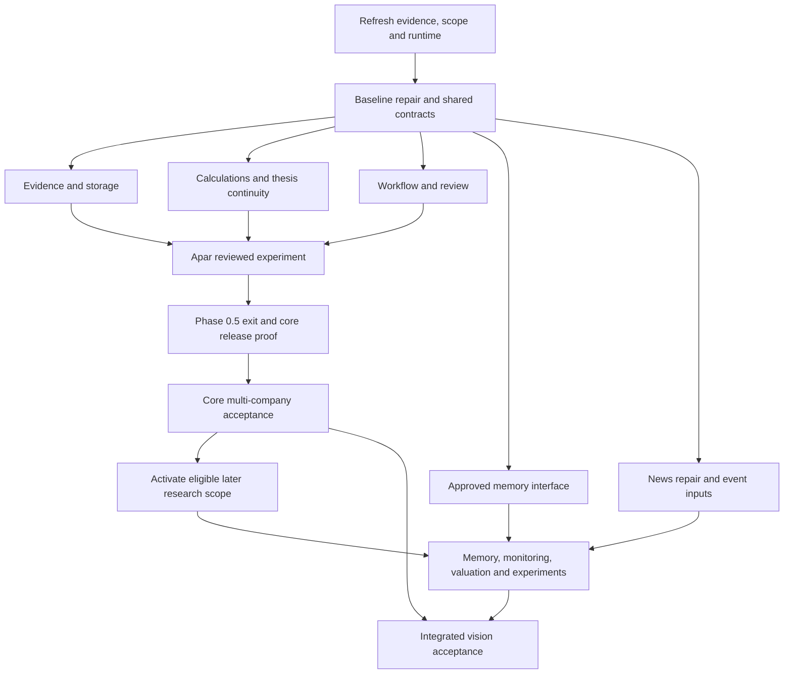

# Equity-OS Product Completion — Gold Goal

**Prepared:** 2026-10-02. **Status:** execution contract prepared for the user's next run; this document is not a product-completion certificate.
**Origin:** the user requested maximum useful parallel execution toward the complete project vision, with vision satisfaction as the final verification.
**Document task:** `eqos-a8i`. **Execution tracking:** Beads; reuse existing product issues before creating missing work.

## 1. The goal and the vision

Deliver a persistent, evidence-governed equity-research system for Indian markets that maintains an approved analytical view of covered companies across time, automates evidence collection and analysis, and presents material exceptions for accountable human review.

The user must be able to answer five questions from the product:

1. What happened in the business, its financial results, disclosures, and management commitments?
2. Why did the business change, and which explanations are observed, computed, inferred, forecast, or opinion?
3. What did we previously believe, what did management promise, and what remains unresolved?
4. Which new evidence supports, contradicts, or invalidates the approved thesis?
5. What should be researched or monitored next, with what assumptions, catalysts, risks, and observable falsifiers?

The product follows evidence through collection, extraction, reconciliation, deterministic calculation, analytical drafting, claim validation, human review, and versioned approved artifacts. SQL records facts and decisions; source originals remain immutable; curated memory preserves approved learning. The language model explains and challenges; registered code supplies authoritative numerical results.

The first demonstration is the Apar four-quarter earnings-review workflow. It is a necessary vertical slice, not the entire vision. The broader research vision includes longitudinal memory, material event review, financial modeling, peer/sector work, structured screening, and controlled experiments where their activation gates are met.

The current distribution boundary is private/internal research. Portfolio construction, public or paid distribution, personalized recommendations, paper trading, and live execution remain separately deferred capabilities. The research product must preserve that boundary. Original initiation and portfolio/risk ambitions need explicit full-vision scope dispositions; their first-release deferral does not mean permanent exclusion. Live execution is an optional extension in the original roadmap, not an implied research-release prerequisite.

## 2. Read and reconcile authority once

Read these sources before scheduling implementation:

| Source | Meaning |
|---|---|
| `AGENTS.md`, `CONTEXT.md`, `.codex/project/` | Operating rules and glossary. Several orientation facts are stale; verify factual claims against code and accepted evidence. |
| `docs/blueprint/funda-blueprint-implementation-decision-register-v2.md` | Canonical decision requirements, dependencies, phase gates, and Deferred/Rejected controls. |
| `docs/goals/equity-os-blueprint-completion.md` | Existing authority and phase-exit contract. Its old current-phase index is not current completion evidence. |
| `docs/goals/architecture/architecture-brief-v2.md` and `docs/goals/architecture/equity-os-architecture-of-record-v2.html` | Approved architecture, component ownership, trust boundaries, and current/future split. |
| `docs/blueprint/funda-blueprint-final-consolidated-review.md` | Product rationale. |
| `docs/blueprint/org/funda-agentic-stock-research-blueprint.md` | Original ambition and research modes; reconcile it with the later approved review and architecture before treating a suggestion as a build requirement. |
| `docs/workstreams/fundamentals-pilot/phase-0.5-assisted-updates-plan.md` | Current Apar build record and remaining reviewed experiment. |
| `docs/evidence/phase-0a/a-13-success-metric-contract-final.md` | Accepted measurement methods and forward product-owner targets. |
| `docs/evidence/phase-0.5/` and live Beads records | Actual Apar decisions, approvals, work state, and remaining human actions. |

Current explicit user instructions retain precedence. This goal does not silently change approved architecture, supply competent-human decisions, approve source rights, or activate Deferred register rows. Pursue authorized work without repeated routine permission requests. When a distinct required decision is missing, record the exact affected obligation and continue independent eligible work.

Reconcile stale register statuses by recording exact accepted evidence and decision provenance, then making the smallest authorized document correction. Phase 0A is recorded closed in `eqos-3ps`; an old prose statement must not recreate that cleared block. Conversely, an issue closure or a status word cannot replace the evidence required for a later gate. Conflicts in substantive requirements remain unresolved until the relevant authority resolves them.

## 3. Baseline to refresh at execution start

This is a dated observation, not a promise about the next checkout:

| Area | Observed state on 2026-10-02 |
|---|---|
| Product implementation | `src/fundamentals/`, Python project, CLI, source adapters, append-only fact values, snapshot storage, cross-source comparisons, reports, thesis tooling, and review telemetry exist. Canonical-selection metadata is not yet an append-only temporal history; `FactStore.query_canonical()` has no cutoff argument. |
| Apar | Four quarters render; QoQ/YoY comparatives, management ledger, deterministic thesis-impact predicates, and review-session tooling are recorded delivered. |
| Q0 | `docs/evidence/phase-0.5/q0-approved-thesis.md` is analyst-approved, with its YAML twin. `q0-fact-confirmation.md` still awaits confirmation of figures and commitments. Thesis approval does not confirm those facts. |
| Assisted reviews | `eqos-4j2.8` is open; three sequential owner-reviewed updates and exit evidence remain outstanding. |
| Product tests | Fresh run: 1,840 passed, 15 skipped, 1 failed. `tests/fundamentals/test_news.py::test_news_cli_fixture_renders_sourced_event_table` reproducibly returns no events instead of the two expected fixture events. |
| Static checks | Ruff lint and formatting for `src` + `tests/fundamentals` passed; strict mypy passed for 179 source files. |
| Wider repository | `eqos-xa1` records older failures/lint problems outside the product gate. Those were not reverified by the product test run. |
| Open risks | Unbacked retained source documents (`eqos-4j2.13`), same-quarter ledger replay (`eqos-4j2.11`), thesis breach aggregation/recovery (`eqos-4j2.14`), acquisition storage integration (`eqos-f2m`), and remaining breadth/MCP work. |
| Integrated gaps | The report's driver commentary, thesis impact, and memory draft still contain placeholders; separate commands do not prove integrated output. Draft number checking accepts membership in a known-number set, which does not prove the number supports the claim's subject/metric/period. |
| Temporal gap | `api/pipeline.py` currently assigns the configured cutoff as knowledge/first-seen time. Preserve real acquisition times; a retrospective publication timestamp is not evidence that the product had captured the document then. |

Start by recording HEAD, working-tree changes, active runtime capabilities, Beads state, scope-specific checks, skip reasons, and available retained inputs. Preserve pre-existing user edits. Resolve the reproducible test failure through systematic debugging before using a green-gate claim. Audit skip reasons rather than copying historical counts or installing every optional dependency by default.

## 4. One completion ladder, with no inflated verdict

There are three different milestones:

| Milestone | Required result |
|---|---|
| `PILOT_PROVEN` | Apar Q0 confirmed; three actual assisted updates reviewed in order; the required Phase 0.5 exit evidence accepted. |
| `CORE_RESEARCH_RELEASE` | The current approved private research requirements pass on the selected two or three core companies, including correction, reproducibility, review economics, and operational recovery. |
| `VISION_COMPLETE` | Every vision obligation below passes with evidence, including the later research capabilities required by the agreed full-vision scope. A core release alone cannot earn this verdict. |

At startup create a scope record binding each V-row below to the relevant approved requirements, current activation state, exact user-visible demonstration, and required evidence. The V-rows are proposed acceptance scenarios under this goal, not amendments to the architecture. Later capabilities require the existing activation and preceding-gate decisions before implementation. While a required full-vision row is deferred, blocked, failed, or unproven, `VISION_SATISFIED` is `NO`.

Also perform the reverse coverage check: enumerate every A–E register requirement, applicable architecture obligation and phase-exit clause, and reconciled original-vision promise. Map each to a V-row and exact proof, another named proof, or an authority-backed full-vision exclusion. Bind the complete sorted source-requirement set to source revisions; an independent reviewer checks that no source obligation disappeared. Record accepted prior evidence explicitly. First-release deferral is not a full-vision exclusion. Unresolved scope for automated initiation, the portfolio/risk question, conditional features, or any other promise yields `VISION_SATISFIED: NO` without activating implementation or blocking unrelated eligible work.

A product-owner decision may revise the vision scope in a separately recorded successor contract. Preserve this contract and explain the changed scope; do not silently remove an obligation to obtain a pass. A vendor/tool choice can be rejected while the underlying capability passes through a simpler implementation.

## 5. Vision obligations and user-visible acceptance

Each scenario must run through the production interfaces and retained evidence, with adversarial fixtures supplementing real cases. Fixture-only success, populated directories, or model agreement cannot substitute for the required real demonstration.

| ID | Promise and requirement anchors | Evidence required for PASS |
|---|---|---|
| V01 | **Reliable evidence and facts.** S09/S10/S12/S17; B-03/B-05/B-09/B-11; C-02/C-03/C-06/C-07/C-17. | Retrieve or replay a real approved company package; preserve original hashes and exact locations; distinguish company/security identities, quarter/YTD, currency, dimensions, and standalone/consolidated scope. Store conflicts and revisions without overwrite. Demonstrate authorized capture and failure records for membership/security changes, prices, announcements, corporate actions, and shareholding. Show a real identifier/corporate-action case. |
| V02 | **A real incremental earnings review.** S05/S06/S14/S18; B-01/B-02/B-04. | Complete Apar Q0 and Q1–Q3, each using the approved prior analytical view. Reports show facts, changes, driver analysis, management commitments, thesis impact, falsifiers, unresolved questions, calculation traces, and exact approval records. Reviewer time and edits are measured, not inferred. |
| V03 | **Traceable financial analysis.** S13/S16; B-06/B-07/B-12; C-04/C-08. | Registered calculations demonstrate growth, margins, cash conversion, leverage, share-count/dilution, guidance comparisons, and reconciliation where applicable. Each material computed result resolves to inputs and a versioned trace; missing input or ambiguous definition refuses the result. Every material factual claim has correct support and epistemic labeling. |
| V04 | **A thesis with a change history.** S06/S13/S14/S15; B-02/B-14; C-10. | Across a real quarter window, show supporting and disconfirming evidence, management promise status, falsifier outcomes, open questions, and the reason for the approved view. Resolve the aggregation/recovery semantics in `eqos-4j2.14` through an explicit analytical policy. A rejected material claim invalidates the affected downstream closure and produces a new immutable package. Correct an already-published artifact: every affected receipt becomes non-current, historical receipts remain inspectable, and fresh approval precedes a new publication receipt. |
| V05 | **Exception review and workflow reliability.** S11/S14/S15; B-01/B-13/B-14; C-05/C-09/C-16. | The analyst accepts, edits, rejects, and defers actual claims; jumps to exact sources; inspects calculation inputs; reviews only relevant differences. Inject a failure, resume the exact step, and rerun a completed quarter without deletion or duplicate canonical changes. Seeded errors remain isolated from approved artifacts. |
| V06 | **Trustworthy longitudinal memory.** S19/S20; D-01–D-05. | Retrieve prior approved theses, commitments, contrary evidence, and unresolved questions with cutoff/provenance. Demonstrate stale/contradictory conclusion detection, separately approved promotion, correction, deletion, export, and restored retrieval. Compare the permitted memory approaches fairly; adopt GBrain only if justified. The canonical promotion transaction and benchmark remain gated until explicitly activated. |
| V07 | **Material event review and monitoring.** S24; E-04. | Bind a known-event population and independently labeled expected outcomes before evaluating detection. Report misses, false alerts, analyst effort, latency and operating cost under approved methods/targets; a hand-picked successful replay set is insufficient. Deduplicate equivalent filings; identify the affected fact, assumption, catalyst, promise, falsifier, or thesis breaker. Route a material event into review; an immaterial event creates no thesis change. Demonstrate authorized recurring/event-triggered capture and restart, including failures. Missing scheduling authority remains an explicit blocker; operator-triggered rights do not authorize a scheduler. |
| V08 | **Financial modeling and risk scenarios.** S21; E-01. | Record the approved model-grade operator list and chosen company's valuation method before the test. Reproduce statement tie-outs, valuation inputs, assumptions, the applicable DCF/SOTP model, WACC, and sensitivities using registered code. Show downside and upside drivers, uncertainty, and missing-input refusal. Research scenarios do not enable portfolio construction or orders. |
| V09 | **Coverage, peer work, and research shortlists.** S17/S18/S22; C-01/C-17/C-18; E-02; original blueprint research modes. | Complete the approved two/three-company core universe, then the separately activated difficult-company cases. Compare peers on common registered definitions and basis; screen structured data into a bounded research shortlist with provenance and explainable criteria. A company baseline remains accountable and reviewed; automated full initiation requires a separate scope decision. |
| V10 | **Honest controlled experiments.** S25; E-05/E-10. | A bounded, pre-registered experiment replays point-in-time data; discloses universe history, revisions, fees, liquidity, benchmarks, and limitations. Post-cutoff source/tool data are rejected. Model-weight leakage is disclosed, and retrospective LLM results are never presented as clean alpha proof. |
| V11 | **A maintainable private product.** S02/S07/S08/S10/S11/S18; A-05/A-07/A-08/A-12/A-13; C-11/C-12/C-13/C-18. | An independent operator can install, run, inspect, and recover the product from documented interfaces. Golden cases and quality gates pass; costs, latency, failure/retry rates, analyst time, and coverage are measured against accepted methods. Back up retained source evidence to an authorized destination and verify a clean restore. Reconstruct approved outputs from authoritative evidence/records without access to raw model scratchpads. Preserve source rights, credentials, and the research/execution boundary. |
| V12 | **Historical reconstruction and safe change.** S10/S11/S12/S15/S19; B-10; C-09/C-10/C-15/C-16. | Reconstruct the exact evidence package and approved narrative hash for an earlier eligible run. Insert a later restatement, parser re-extraction, and correction; the historical run remains unchanged while an eligible successor reflects the change. Produce the workflow-derived schema-delta record identifying retained, removed, added and deferred fields with evidence and required acceptance. Source text and retrieved memory cannot alter permissions, cutoffs, tools, or approval policy. |
| V13 | **Evidence-based analytical challenge.** S23; E-03. | After activation, compare bull/bear and forensic challenge with the same evidence given to a single senior reviewer. Adjudicate valid additional issues, false alarms, analyst effort, latency, and cost. Retain the added method only if the approved benefit criterion passes; an accepted non-adoption outcome is valid. Unsupported allegations or invented investment-persona consensus are not findings. |

The original vision includes exploratory modes whose release scope was later narrowed. V09's peer/shortlist scenario needs a bounded approved contract; it does not turn full automated initiation into active implementation permission. Resolve every broader ambition through the reverse coverage record. V06–V10 and V13 are part of the full research acceptance proposal and are not current-phase implementation permission. Record their scope/activation decisions before dispatching their implementation.

### Truthful retrospective Apar demonstration

The retained Apar manifest records acquisition in September 2026, after the original November 2025 Q0 cutoff and the assisted configurations' historical cutoffs. Correct system-knowledge filtering therefore makes those retained inputs ineligible under those old cutoffs. Preserve both facts; changing a configured cutoff cannot backdate acquisition.

Before running the reviewed quarter sequence, prepare and obtain the required acceptance for a successor evaluation contract. It must separate the historical reporting period and any publication-date evidence filter from the actual system-knowledge/evaluation cutoff. For each retained input, bind its genuine acquisition/first-seen evidence and choose an evaluation cutoff no earlier than every admitted input's proven knowledge time. Missing acquisition evidence is excluded or reacquired with an honest new timestamp. Pin eligible source versions; later restatements or revised documents cannot masquerade as the originally published version.

Label the resulting quarter sequence `RETROSPECTIVE_WORKFLOW_DEMONSTRATION`, disclose model-weight and retrospective-selection limitations, and bind new configurations and approvals to the successor record. Preserve existing approved thesis, evidence, and configurations as historical artifacts; an old exact-byte approval does not automatically approve a changed temporal contract or successor analytical output. A retrospective workflow demonstration can prove supported analysis and review behavior under an accepted evaluation method; it cannot prove that the system captured or knew the documents in 2025/early 2026.

Prove cutoff enforcement and reconstruction separately using genuine admitted acquisition times, a captured baseline run and later revisions, plus isolated cutoff-boundary fixtures. If the governing phase gate requires unavailable historical capture, record the missing proof and obtain its explicit scope/method disposition; do not use retrospective labeling as an implicit waiver. Prepare this temporal decision together with Q0 confirmation while independent storage, replay, and test repairs continue.

## 6. Execute through independent work lanes

Use the execution skill for each approved bounded unit. Elaborate just-in-time implementation packets using the planning skill's file/interface/test template; get the required document review before dispatch. Keep Beads as work-state authority. Reuse `eqos-4j2`, `eqos-kx4`, and their existing children; do not seed duplicate roadmap structures or create a full future task tree before the actual decomposition is accepted.

The runtime owns model selection, effort, sandboxing, and available concurrency. The user requested an Ultra orchestrator with maximum useful parallelism. Honor that session setting when it is available; verify CLI execution before relying on a model catalog entry. Keep runtime bindings outside product APIs and canonical requirements. Start no more workers than the verified concurrent capacity, retain a coordination/review slot where possible, and do not silently fall back to a different requested model or effort.

**Dated runtime evidence:** Codex CLI 0.160.0 listed the user-requested `gpt-6.1-sol` with `ultra` and described that effort as maximum reasoning with automatic task delegation. A read-only ephemeral invocation executed successfully with that exact model/effort, followed by three independent analysis runs. Evidence is captured in `scratchpad/product-completion-gold/`; it must be refreshed when runtime truth matters. The user's explicit selection supersedes older skill-only model/effort restrictions for this requested run. This is execution proof, not a throughput guarantee or account-limit measurement.

Launch subagents through Codex CLI per the current routing instructions. Implementation workers receive only their approved file scope, contracts, test seams, and source pointers. Reviewers are independent and read-only. Every worker is told that others are changing the repository and that it must preserve their edits. Shell output and final reports are captured to known workspace paths. Workers report actual commands and exit statuses; the coordinator verifies them.

The following lane map is a decomposition proposal to refine against live code before creating execution stages:

| Lane | Responsibility and candidate ownership | Consumes / produces | Parallel boundary |
|---|---|---|---|
| L0: integration and acceptance | Coordinator owns scheduling and evidence; a designated integration implementer owns shared CLI/config/contracts/manifests and operator documentation. | Frozen interfaces, worker changes, review verdicts → integrated release and vision evidence. | One writer per shared path. The coordinator does not become the sole implementer and reviewer of its own change. |
| L1: temporal evidence and durable storage | `entity/`, `store/`, corresponding contracts and owned tests; narrow the actual files per task. Address stable identity, selection history, cutoff-aware facts, sealed evidence packages, and backup/restore. | Approved source/config contracts → immutable captures and provenance-bound facts selected at a cutoff. | Never share `store/fact_store.py` or `store/snapshot_store.py` with another writer. Interface changes land before dependent workflow/memory tasks. |
| L2: workflow and claim review | `api/pipeline.py`, `api/review_cli.py`, `output/review_session.py`, `output/earnings_update.py`, and proposed workflow modules under an approved packet; owned tests. | Facts, evidence versions, claim IDs, prior approved thesis → resumable states, decisions, correction closure, immutable approvals and complete reports. | Own review/workflow/report internals. Register shared parser/config/dispatcher edits through L0. |
| L3: registered compute | `verify/metric_registry.py`, `api/comparatives.py`, `api/run_comparatives.py`, comparative contracts, and proposed approved compute modules; owned tests. | Typed facts and approved operator definitions → input-fact/code-version-bound calculation traces. | Freeze metric and trace IDs before L2/L4 integration. Cash-flow/share-count operators require actual verified source inputs. Later valuation uses the same trace interface after activation. |
| L4: thesis, commitments and governed memory | `thesis/`, `output/management_ledger.py`, `verify/thesis_predicates.py`, `verify/thesis_impact.py`, proposed `memory/`, and owned tests. Split into bounded packets following S19/S20. | Frozen fact/claim/evidence identities, calculation traces, prior approved view and cutoff API → quarter ledger versions, supported thesis changes, staged memory and retrieval. | Resolve analytical choices explicitly. Neutral interface work can proceed after inputs are fixed; canonical promotion depends on its distinct gate. |
| L5: acquisition, events and later analysis | `ingest/`, `news/`, `contracts/news.py`, `api/news_cli.py`, and later approved monitoring/peer/experiment modules; owned tests. Split into separate packets. | Approved access, immutable capture interfaces, verified identities and metrics → source-health outcomes, event dossiers, comparisons and experiment evidence. | News repair can proceed now. Coordinate snapshot-store changes through L1 and shared CLI changes through L0. Later modules wait on their real inputs and activation. |

Shared `api/cli.py`, `api/cli_parser.py`, `api/config.py`, package manifests, canonical contract files, and acceptance manifests have one named writer in each batch. Other workers submit the required interface change in their report instead of racing that writer. Test support modules have the same ownership discipline. A worker cannot rewrite another worker's tests to make integration pass.

Freeze only interfaces needed by the current batch. Prefer extending existing modules and public seams; a new framework, database, workflow engine, agent abstraction, or memory engine needs evidence that the existing approach cannot meet the requirement.

### Dependency graph



Edges mean genuine prerequisites, not arbitrary ordering. Source retention and tests can progress while owner confirmation is pending. A missing human review blocks the associated phase exit and dependent activated work; it does not block unrelated approved repairs. If workstream execution serializes phases, run separate eligible task/phase scopes for independent lanes rather than overriding its phase semantics.

## 7. Use the first hour productively

Treat one hour as an execution budget, not a completion estimate. Ask the runtime for current usage only if it exposes a supported capability; the user's reported remaining percentage is a planning input, not a measurable account fact.

| Elapsed window | Intended result |
|---|---|
| 0–10 minutes | Refresh baseline and permissions, resolve scope/gate conflicts, record owned paths, identify required owner decisions in one concise batch, and dispatch ready independent work. |
| 10–40 minutes | Keep available worker slots on accepted bounded slices: reproducible news failure; ledger replay/idempotency; capture-store integration; approved neutral contracts; retained-source restore proof when the destination is authorized. Choose by the critical path, not by task count. |
| 40–55 minutes | Integrate completed slices in dependency order, run scoped regression and negative proofs, and obtain independent review of the combined behavior. Continue other eligible work while a review runs. |
| 55–60 minutes | Save exact evidence and unresolved work, make the current completion verdict, and prepare the next executable packet. Finish an already-running verification safely; do not abandon workers or label incomplete work complete. |

The windows guide prioritization; a usage reset is not a product-completion deadline. If the runtime remains available and the user has not stopped the goal, start the next verified batch after the checkpoint and continue under the same authorization. Allocate some budget to integration and proof before filling every slot with new implementation. A slow or ambiguous foundational contract is a reason to narrow a packet, not to distribute contradictory assumptions across workers. Spend available capacity on useful implementation and evidence rather than redundant exploration, cosmetic review rounds, or re-running unchanged green suites.

Observe liveness through metadata and state changes; do not repeatedly reread full transcripts. Inspect detailed artifacts on completion, attention, failure, or a suspected stall. Check a worker running beyond ten minutes using actual process/output/file signals. Do not create unauthorized recovery rounds or endless retries. Capacity/authentication failures follow the current one-retry policy, then remain honestly reported.

## 8. Human decisions and deferred capabilities

Prepare concrete reviewable results before asking for a required decision. Routine code, test, and document work within an already authorized packet proceeds without another permission request.

| Decision | What the executor prepares | What it cannot manufacture |
|---|---|---|
| Apar Q0 confirmation (`eqos-4j2.3`) | Exact source pages/anchors, cross-checks, six figures and two commitments in `q0-fact-confirmation.md`. | The owner's figure/commitment confirmation or timing record. |
| Sequential updates (`eqos-4j2.8`) | Reviewable Q1 report, claim inventory, evidence, calculations, then the next report after the preceding required review. | Analyst approval, invented review minutes, or a claim that model consensus is human review. |
| Thesis aggregation/recovery (`eqos-4j2.14`) | Concrete breach/recovery examples, candidate policies, and their deterministic consequences. | The analytical policy or thresholds as an inferred owner decision. |
| Vocabulary/metric acceptance | Exact proposed metric/predicate definitions, aliases, units, scope, dimensions, and compatibility examples. | Required competent domain acceptance from process approval alone. Reuse valid existing entry approvals. |
| Backups (`eqos-4j2.13`) | Source inventory, hashes, restore test, and an exact proposed destination when none is authorized. | An off-workspace/cloud destination, access, or a claim of durable backup from a second copy on the same disposable disk. |
| Later scope and source use | Exact capability contract and its current v2/architecture gates; rights and credential requirements for the intended use. | Activation, regulatory/source-use authority, new unattended schedules, or permission to upload held source documents to external models. |

Existing approval evidence must be reused when it actually covers the decision. A changed runtime does not erase user authorization. Source-specific restrictions, including operator-triggered versus unattended use, still apply. Rights research and private evidence handling remain in the coordinator's authorized environment; credentials and private captures never enter worker prompts or committed artifacts.

## 9. Verification: evidence first, vision last

### Engineering checks

Run fresh against the integrated candidate. Commands below are the verified current project shape; if the environment differs, report the supported equivalent and actual scope.

```bash
uv run pytest tests/fundamentals -q
uv run ruff check src tests/fundamentals
uv run ruff format --check src tests/fundamentals
uv run mypy --strict src
git status --short --branch
```

The existing `.venv/bin/python`, `.venv/bin/ruff`, and `.venv/bin/mypy` are suitable environment-local equivalents when dependency resolution is already complete. `scripts/verify.sh` additionally verifies scoped implementation evidence and security rails when used through the execution engine; inspect its current help/contract instead of fabricating a run identity or red proof.

Run relevant wider repository checks separately and report their scope. Baseline exclusions may be recorded, but no required V-row may hide behind an excluded failing test. Explain every skipped test affecting acceptance; required real cases cannot be marked passed because their live/OCR test skipped. Red proofs and fixture protections must remain intact; verify `eqos-283` against the current script before assuming its reported defect still exists.

### Negative proofs

The integrated acceptance run must demonstrate these failures are rejected or preserved correctly:

- Wrong company, period, quarter/YTD, consolidation basis, currency, unit, or metric definition cannot become a confirmed comparison or published fact.
- Missing source support, fabricated citation, missing calculation input, unsupported material claim, and corrupted raw hash cannot pass approval/publication eligibility. A wrong-subject or wrong-period claim containing an otherwise valid number must also fail semantic evidence validation.
- Post-cutoff source data, later canonical selections, later restatements, and future memory records cannot rewrite the historical package.
- Document or memory text that requests tool access, credential disclosure, changed permissions, relaxed cutoffs, or canonical promotion is treated as data.
- Reject/edit/defer, process crash, retried ingestion, and same-quarter replay preserve the correct workflow state, immutable prior artifacts, and affected-only revalidation.
- Forged, stale, wrong-scope, reused or byte-mismatched approvals/authorizations fail at their direct admission boundaries. Changed report/evidence bytes invalidate the affected prior approval rather than inheriting it.
- A correction after publication makes every affected receipt non-current before rework; prior bytes/receipts remain auditable, and only fresh acceptance and a new receipt can make the successor current.
- Auth expiry, transport error, rate limit, unavailable basis, unoffered surface, verified-empty result, and parser drift remain distinct outcomes with retained evidence where authorized.
- Shadow/golden artifacts cannot promote or publish; report approval cannot substitute for separate memory promotion; non-private distribution and execution remain closed without their gates.

### Measurement and final review

Use accepted A-13 methods and targets directly from their current record. The recorded targets include complete numerical traceability, zero accepted unsupported claims, factual/citation targets, analyst-time/cost/latency ceilings, and a coverage ambition. Those are forward targets, not previously measured achievements. No report-level P90 at three updates; no fabricated manual baseline; no extrapolated weekly capacity from a small unrepresentative sample. Reconcile the five-companies/week capacity ambition with the two/three-company core universe and available observation window before reporting capacity PASS. Where a method or comparison no longer fits the owner-approved Q0 approach, obtain the narrow corrected contract before claiming an economics pass.

A fresh independent reviewer receives this goal, the bound scope, exact candidate revision/diff, operator instructions, real demonstration artifacts, adversarial results, actual metrics, and unresolved findings. The reviewer exercises the user-facing path and judges every V-row; it does not merely summarize worker reports. Independently review trust boundaries and persisted-state changes under the applicable skills. Critical or load-bearing gaps block the affected acceptance regardless of green tests or time pressure.

## 10. Required acceptance record and final verdict

Produce `docs/evidence/product-completion/vision-acceptance.md` and a machine-readable `vision-acceptance.json` once execution has evidence to report. Include the exhaustive source-to-acceptance coverage table, its revision-bound requirement set, and every full-vision scope disposition. These are output artifacts to create, not existing proof. Keep the contract here static; Beads holds live work state.

For every V-row, record:

- Bound requirement and activation decision; `PASS`, `FAIL`, `BLOCKED`, or `NOT_PROVEN`.
- User-visible scenario, exact input versions/hashes and knowledge cutoff, candidate code revision, commands, exit statuses, output paths/hashes, and test scope.
- Actual reviewer decisions and metrics, independent reviewer evidence, and any source rights or operational limitations.
- Exact remaining work and Beads ID when the result is not PASS.

Conclude with these literal fields:

```text
PILOT_PROVEN: YES | NO
CORE_RESEARCH_RELEASE: YES | NO
VISION_SATISFIED: YES | NO
```

`VISION_SATISFIED: YES` requires exhaustive source coverage without unresolved dispositions, every agreed full-vision V-row and other required proof to pass, every applicable preceding phase gate to pass, required human decisions to be genuine, and no unresolved finding that invalidates those demonstrations. Unknown or blocked evidence yields `NO`, with the reason. Optional vendor non-adoption does not force `NO` when the capability passes through the accepted simpler route. A missing required capability does.

A root goal, epic, or product-completion certificate is closed only after its actual acceptance holds. Green tests, elapsed time, exhausted usage, worker completion messages, a large diff, and a list of closed issues do not establish vision satisfaction.

## 11. Checkpoint and launch

Before a limit/reset/context handoff, persist Beads acceptance/status/notes, the current reviewed implementation packet, worker session/report paths, the exact integrated revision and dirty baseline, current verification evidence, required decisions, and the next runnable packet. Keep worker outputs in `scratchpad/execution/` under the execution skill's scope-specific slug. Human decisions and final evidence belong in the appropriate tracked `docs/evidence/` paths; raw source/private captures and secrets remain uncommitted.

Do not commit, push, or synchronize merely to consume remaining usage. Apply current explicit authority to each action; stage exact named files and preserve unrelated edits. A local checkpoint is a resumable state, not an off-machine backup. If the run ends before acceptance, report achieved behavior and `VISION_SATISFIED: NO` with a concrete continuation.

After switching the session to the desired runtime, the user can start with:

> Read `docs/goals/equity-os-product-completion-gold.md` and execute toward its full vision gate. Use my selected runtime and effort, maximize useful parallel work within verified capacity, and continue all independent authorized work. Reuse existing approvals and Beads tasks. Preserve required human and source-use gates. Verify the integrated product through real user-visible workflows and report the literal completion verdicts. Do not claim the vision is satisfied until the evidence proves it.

**First executable action:** refresh the live baseline and scope record, then dispatch the reproducible news failure and other approved non-overlapping critical-path packets while preparing the Apar Q0 confirmation package.
